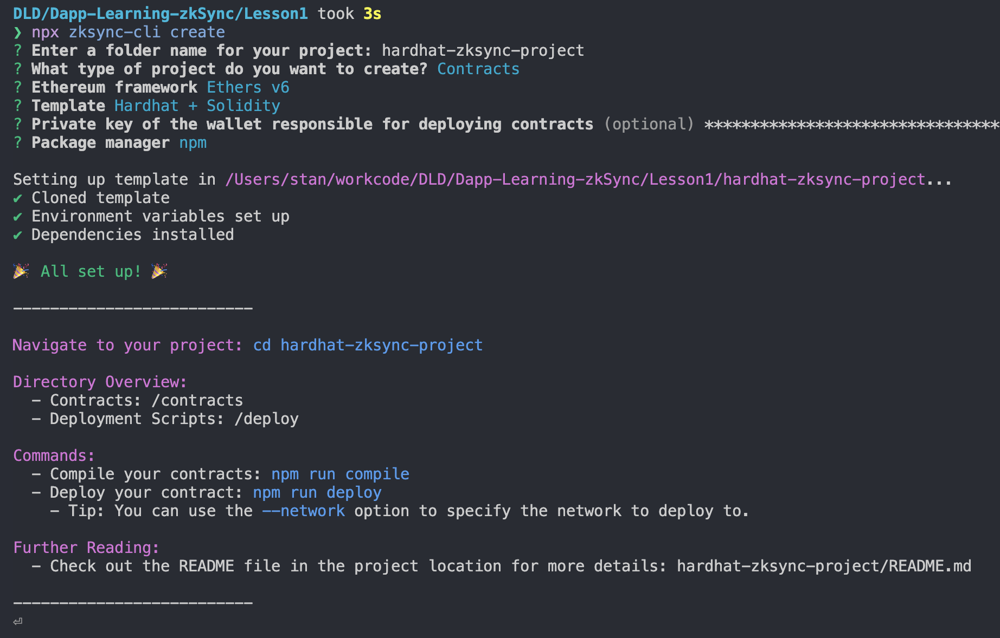
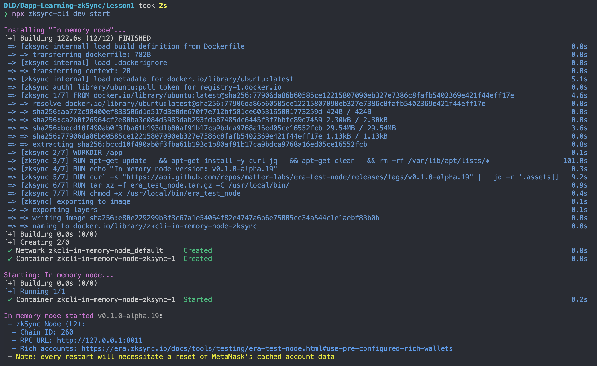
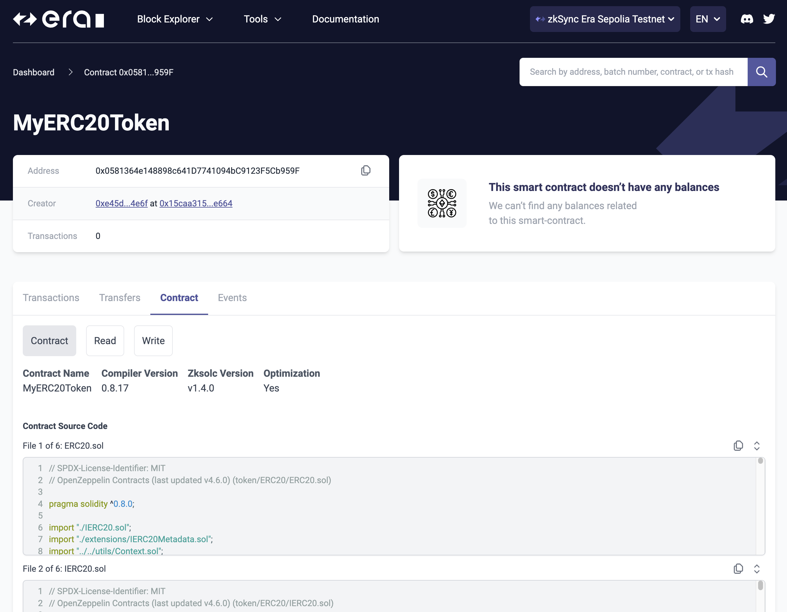
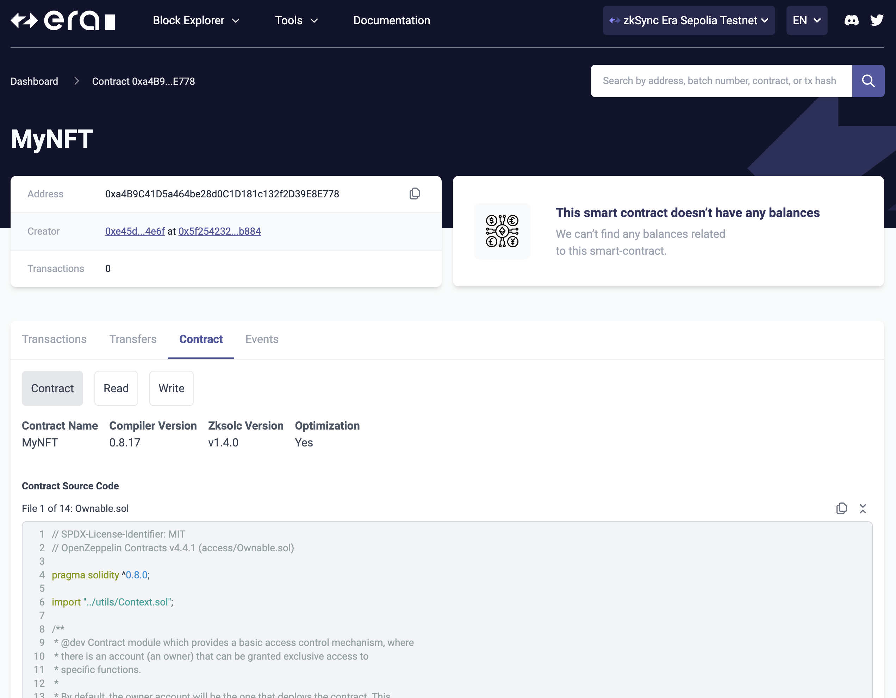

# Lesson 1: Quick Introduction to zkSync Development

## Quick Introduction to zkSync Development

### Prerequisites

1. 准备一个测试账号，并保证在 zksync-sepolia network 上有充足的 gas ([参考此步骤获取](./docs/how_to_get_zksync_sepolia_eth.md)).
2. 掌握基本的 solidity 开发技能, 以及 hardhat, ethers.js 的基本使用方法 (参考我们的 [Basic Tasks](https://github.com/Dapp-Learning-DAO/Dapp-Learning/tree/main/basic) 学习).
3. 熟悉下列开发工具 👇.

### Tooling

- [Block Explorer](./docs/Tooling.md#block-explorer)
- [zksync-cli](./docs/Tooling.md#zksync-cli)
- [Foundry with zkSync](./docs/Tooling.md#foundry-with-zksync)
- [hardhat-zksync-toolbox](./docs/Tooling.md#hardhat-zksync-toolbox)
  - hardhat-zksync-solc
  - hardhat-zksync-deploy
  - hardhat-zksync-chai-matchers
  - hardhat-zksync-verify

### Deploy with hardhat

我们将使用 hardhat 开发 ERC20, ERC721 合约，并将他们部署到 zksync-sepolia testnet 网络上。

#### 创建项目(hardhat)

- 安装 `zksync-cli`, 输入命令后会提示是否安装，输入 `y` 安装

```sh
npx zksync-cli@latest
```

- 使用 `zksync-cli` 创建项目

```sh
npx zksync-cli create
```

- 根据命令行提示，依次 输入 或 选择

  - 项目名称 `hardhat-zksync-project`
  - 选择项目类型为 `Contracts`
  - 选择开发框架 `Etheres v6`
  - 初始化模板 `Hardhat + Soidity`
  - 输入钱包账户私钥
  - Package manager `npm`

- 等待安装 node_modules 依赖

- 安装完成，项目初始化完毕，我们会看到以下输出



- 进入项目目录，此时能在 `./contracts` 目录中看到 `erc20` 和 `nft` 目录

```sh
cd hardhat-zksync-project

tree -I 'node_modules'
.
├── LICENSE
├── README.md
├── contracts
│   ├── Greeter.sol
│   ├── erc20
│   │   └── MyERC20Token.sol
│   ├── nft
│   │   └── MyNFT.sol
│   └── paymasters
│       ├── ApprovalPaymaster.sol
│       └── GeneralPaymaster.sol
├── deploy
│   ├── deploy.ts
│   ├── erc20
│   │   └── deploy.ts
│   ├── interact.ts
│   ├── nft
│   │   └── deploy.ts
│   └── utils.ts
├── hardhat.config.ts
├── package-lock.json
├── package.json
└── test
    ├── erc20
    │   └── myerc20token.test.ts
    ├── greeter.test.ts
    └── nft
        └── mynft.test.ts
```

- 查看 `hardhat.config.ts` 的配置，在刚才通过模板创建的项目中，已经预先配置了 zksync Era 主网，测试网，以及本地测试网
  - `zkSyncMainnet` 主网
  - `zkSyncSepoliaTestnet` zksync sepolia 测试网
  - `zkSyncGoerliTestnet` zksync goerli 测试网 ([zksync goerli 网络即将关闭](https://github.com/zkSync-Community-Hub/zksync-developers/discussions/228)，不建议使用)
  - `dockerizedNode` docker 本地 Node 网络
  - `inMemoryNode` 本地测试网络
  - `hardhat` hardhat zksync 本地测试网络

> `inMemoryNode` 可以理解为 zksync Era 版本的 `hardhat node`, 是 zksync Era 用于本地测试的持久化节点

```ts
// hardhat-zksync-project/hardhat.config.ts
const config: HardhatUserConfig = {
  defaultNetwork: "zkSyncSepoliaTestnet",
  networks: {
    zkSyncMainnet: {
      url: "https://mainnet.era.zksync.io",
      ethNetwork: "mainnet",
      zksync: true,
      verifyURL:
        "https://zksync2-mainnet-explorer.zksync.io/contract_verification",
    },
    zkSyncSepoliaTestnet: {
      url: "https://sepolia.era.zksync.dev",
      ethNetwork: "sepolia",
      zksync: true,
      verifyURL:
        "https://explorer.sepolia.era.zksync.dev/contract_verification",
    },
    zkSyncGoerliTestnet: {
      // deprecated network
      url: "https://testnet.era.zksync.dev",
      ethNetwork: "goerli",
      zksync: true,
      verifyURL:
        "https://zksync2-testnet-explorer.zksync.dev/contract_verification",
    },
    dockerizedNode: {
      url: "http://localhost:3050",
      ethNetwork: "http://localhost:8545",
      zksync: true,
    },
    inMemoryNode: {
      url: "http://127.0.0.1:8011",
      ethNetwork: "localhost", // in-memory node doesn't support eth node; removing this line will cause an error
      zksync: true,
    },
    hardhat: {
      zksync: true,
    },
  },
  zksolc: {
    version: "latest",
  },
  solidity: {
    version: "0.8.17",
  },
};
```

#### 启动本地测试网络

- 现在我们将使用 `zksync-cli` 启动一个本地测试网络(`zkcli-in-memory-node`)

  - 启动 docker, 新开一个命令行窗口，并输入
  - `zksync-cli` 会自动拉取 docker 镜像，创建 zksync 本地测试网 docker 容器, 并运行

  ```sh
  npx zksync-cli dev start
  ```

  

- 检查本地网络是否正常运行

  - 我们注意到命令行输出有 `RPC URL` 和 `Rich accounts` 的提示，前者是我们本地测试网络的 RPC 链接，后者是测试网中提前配置的测试账号

  ```sh
  In memory node started v0.1.0-alpha.19:
  - zkSync Node (L2):
    - Chain ID: 260
    - RPC URL: http://127.0.0.1:8011
    - Rich accounts: https://era.zksync.io/docs/tools/testing/era-test-node.html#use-pre-configured-rich-wallets
  ```

  - 我们使用命令查看 rich account 的 ETH 余额，检查本地测试网络是否正确运行

    - `wallet balance` 是 zksync-cli 查询余额的命令，也可以用来查询 ERC20 的余额
    - `--rpc` 指定为我们的本地测试网络

    ```sh
    npx zksync-cli wallet balance --rpc http://127.0.0.1:8011
    ? Account address 0x36615Cf349d7F6344891B1e7CA7C72883F5dc049

    undefined Balance: 1000000000000 ETH (Ether)
    ```

#### 编译合约

- 修改 ERC20 合约，给我们的 Token 设置一个喜欢的 `name` 和 `symbol`, 比如 `DappLearningZksyncTutorial`

```solidity
// hardhat-zksync-project/contracts/erc20/MyERC20Token.sol
contract MyERC20Token is ERC20Burnable {
    ...

    constructor() ERC20("DappLearningZksyncTutorial", "DLZT") {
        // Default initial supply of 1 million tokens (with 18 decimals)
        uint256 initialSupply = 1_000_000 * (10 ** 18);

        // The initial supply is minted to the deployer's address
        _mint(msg.sender, initialSupply);
    }

}
```

- 使用 hardhat 编译合约

```sh
npx hardhat compile
```

#### 测试合约(hardhat)

- 初始化项目中已包含预设的测试脚本，我们使用 `hardhat test` 命令运行他们

  - `npx hardhat test --network hardhat`
  - `--network hardhat` 将使用 hardhat 内置测试网络运行

  ```sh
  npx hardhat test --network hardhat
  Downloading era-test-node binary, release: 0.1.0-alpha.19
  era-test-node binary downloaded successfully


    MyERC20Token
      ✔ Should have correct initial supply
      ✔ Should allow owner to burn tokens (154ms)
      ✔ Should allow user to transfer tokens (148ms)
      ✔ Should fail when user tries to burn more tokens than they have (54ms)
    ...
  ```

  - 当然，我们也可以切换到 inMemoryNode 本地测试网络

  ```sh
  npx hardhat test --network inMemoryNode


    MyERC20Token
      ✔ Should have correct initial supply (42ms)
      ✔ Should allow owner to burn tokens (486ms)
      ✔ Should allow user to transfer tokens (458ms)
      ✔ Should fail when user tries to burn more tokens than they have (326ms)
    ...
  ```

  - 两个测试网络的区别在于 hardhat 测试网络不会保存状态，在测试完成后测试网络会停止运行，而 inMemoryNode 则会保存我们刚刚部署的测试合约，以及交互状态

  ```sh
  # 运行测试脚本之后，查询部署账户，可以看到已经消耗了一些gas
  npx zksync-cli wallet balance --rpc http://127.0.0.1:8011
  ? Account address 0x36615Cf349d7F6344891B1e7CA7C72883F5dc049

  undefined Balance: 999999999999.9611820277 ETH (Ether)
  ```

#### 部署 ERC20 合约到 inMemoryNode 测试网络

在部署合约到链上之前，我们可以使用本地测试网络演练一遍部署流程，这一环节可以让我们提前发现一些问题，也能更好的 debug。

- 首先为我们的部署账户转一些 ETH 作为 gas
  - 可以从 inMemoryNode 预设的 [rich accountc](https://docs.zksync.io/build/test-and-debug/era-test-node.html#use-pre-configured-rich-wallets) 中挑选一个账户转账给我们用来部署合约的账户 (即初始化项目时，我们输入私钥所对应的账户)
  - 使用 `zksync-cli wallet transfer` 命令
  - 数量输入 1，注意不需要考虑 decimals
  - Private key of the sender 从 rich account 中复制一个私钥贴入
  - Recipient address on L2 贴入我们用来部署的账户地址

```sh
npx zksync-cli wallet transfer --rpc http://127.0.0.1:8011
? Amount to transfer 1
? Private key of the sender [hidden]
? Recipient address on L2 0xe45d43FEb3F65B4587510A68722450b629154e6f

Transfer sent:
 Transaction hash: 0x83e17110660c9af507906bbed28f390a595aac6c3d363e44ba536dadcd959d0f

Sender L2 balance after transaction: 999999999998.99988261205 ETH (Ether)

# 查询部署账户 ETH 余额
npx zksync-cli wallet balance --rpc http://127.0.0.1:8011
? Account address 0xe45d43FEb3F65B4587510A68722450b629154e6f

undefined Balance: 1 ETH (Ether)
```

- 部署 ERC20 合约到 inMemoryNode 本地测试网络

```sh
npx hardhat deploy-zksync --script erc20/deploy.ts --network inMemoryNode

Starting deployment process of "MyERC20Token"...
Estimated deployment cost: 0.0007440487 ETH

"MyERC20Token" was successfully deployed:
 - Contract address: 0x1A595d5fa4bD27fDC1273341eB75eF44Cafb7C2e
 - Contract source: contracts/erc20/MyERC20Token.sol:MyERC20Token
 - Encoded constructor arguments: 0x
```

#### 与合约交互(inMemoryNode)

- 查看部署的 ERC20 合约
  - `zksync-cli contract read` 使用 read 命令可以调用合约函数读取状态
  - 查询 `name()` 方法，选择返回类型为 `string`，zksync-cli 会自动将返回数据 decode 为 string 类型 `DappLearningZksyncTutorial`
  - 查询 `balanceOf(address)` 方法, 我们可以通过 `read` 命令的附加参数直接指定合约地址，函数名和查询参数

```sh
# 使用read命令，根据提示输入查询参数
npx zksync-cli contract read --rpc http://127.0.0.1:8011
? Contract address 0x1A595d5fa4bD27fDC1273341eB75eF44Cafb7C2e
? Enter method to call name()

✔ Method response (raw): 0x0000000000000000000000000000000000000000000000000000000000000020000000000000000000000000000000000000000000000000000000000000001a446170704c6561726e696e675a6b73796e635475746f7269616c000000000000
Provide output types to decode the response (optional)
? Output types string
✔ Decoded method response: DappLearningZksyncTutorial
```

```sh
# 通过 `read` 命令的附加参数直接指定合约地址，函数名和查询参数
npx zksync-cli contract read  --rpc "http://127.0.0.1:8011" --contract "0x1A595d5fa4bD27fDC1273341eB75eF44Cafb7C2e" --method "balanceOf(addres
s)" --args "0xe45d43FEb3F65B4587510A68722450b629154e6f" --output "uint256"

✔ Method response (raw): 0x00000000000000000000000000000000000000000000d3c21bcecceda1000000
✔ Decoded method response: 1000000000000000000000000
```

- 发送交易与合约交互，给另一个账户转账
  - `zksync-cli contract write` 命令可以让我们与合约交互

```sh
# 使用write命令，根据提示输入交易参数
npx zksync-cli contract write --rpc http://127.0.0.1:8011
? Contract address 0x1A595d5fa4bD27fDC1273341eB75eF44Cafb7C2e
? Enter method to call transfer(address,uint256)
? Provide method arguments:
? [1/2] address 0x36615Cf349d7F6344891B1e7CA7C72883F5dc049
? [2/2] uint256 1000000000000000000
? Private key of the wallet to sign transaction ******************************************************************

✔ Transaction submitted. Transaction hash: 0xac2bb1f2835ed44e535a0d6ae664cc5fb45db546dd8b34f9a88358539d7b2914
✔ Transaction processed successfully.
```

```sh
# 通过 `write` 命令的附加参数直接指定合约地址，函数名和交易参数
npx zksync-cli contract write --rpc "http://127.0.0.1:8011" --contract "0x1A595d5fa4bD27fDC1273341eB75eF44Cafb7C2e" --method "transfer(address
,uint256)" --args "0x36615Cf349d7F6344891B1e7CA7C72883F5dc049" "1000000000000000000" --private-key $PRIVATE_KEY

✔ Transaction submitted. Transaction hash: 0x1cb96f0b39961d47610aef957bdda4629aac552308452aabc877aada78a1d085
✔ Transaction processed successfully.
```

#### 查询 transaction 信息

- `zksync-cli transaction info` 可以让我查看链上交易详细信息
  - 选择 `In-memory` 网络
  - 输入要查询的 transacation hash

```sh
npx zksync-cli transaction info
? Chain to use In-memory local node
? Transaction hash 0x1cb96f0b39961d47610aef957bdda4629aac552308452aabc877aada78a1d085
──────────────────── Main info ────────────────────
Transaction hash: 0x1cb96f0b39961d47610aef957bdda4629aac552308452aabc877aada78a1d085
Status: completed
From: 0xe45d43FEb3F65B4587510A68722450b629154e6f
To: 0x1A595d5fa4bD27fDC1273341eB75eF44Cafb7C2e
Value: 0 ETH
Fee: 0.00006116465 ETH  |  Initial: 0 ETH  Refunded: 0.00292334935 ETH
Method: 0x02f8b282

───────────────────── Details ─────────────────────
Date: 3/22/2024, 1:03:11 PM (8 minutes ago)
Block: #25
Nonce: 2
```

#### ERC721 合约部署与交互(inMemoryNode)

初始化项目模板中同样提供了 ERC721 合约(NFT), 若想修改合约的参数，我们需要在其部署脚本中修改

- 修改部署脚本的 name, symbol, baseTokenURI 参数

```ts
// hardhat-zksync-project/deploy/nft/deploy.ts
import { deployContract } from "../utils";
export default async function () {
  const name = "DappLearningWaterMargin";
  const symbol = "DLWM";
  const baseTokenURI = "https://dapplearning.org/watermargin/token/";
  await deployContract("MyNFT", [name, symbol, baseTokenURI]);
}
```

- 部署 NFT 合约

```sh
npx hardhat deploy-zksync --script nft/deploy.ts --network inMemoryNode

Starting deployment process of "MyNFT"...
Estimated deployment cost: 0.0009678828 ETH

"MyNFT" was successfully deployed:
 - Contract address: 0x2042DCd254669aB6a957ee8B0eCEd80C9d11EC58
 - Contract source: contracts/nft/MyNFT.sol:MyNFT
 - Encoded constructor arguments: 0x000000000000000000000000000000000000000000000000000000000000006000000000000000000000000000000000000000000000000000000000000000a000000000000000000000000000000000000000000000000000000000000000e00000000000000000000000000000000000000000000000000000000000000017446170704c6561726e696e6757617465724d617267696e0000000000000000000000000000000000000000000000000000000000000000000000000000000004444c574d00000000000000000000000000000000000000000000000000000000000000000000000000000000000000000000000000000000000000000000002b68747470733a2f2f646170706c6561726e696e672e6f72672f77617465726d617267696e2f746f6b656e2f000000000000000000000000000000000000000000
```

- 发送交易与合约交互，mint NFT

```sh
npx zksync-cli contract write --rpc "http://127.0.0.1:8011" --contract "0x2042DCd254669aB6a957ee8B0eCEd80C9d11EC58" --method "mint(address)" -
-args 0xe45d43FEb3F65B4587510A68722450b629154e6f --private-key $DEPLOY_PK

✔ Transaction submitted. Transaction hash: 0xabc430ae8ce84aee4a25e2f946ed416da361ff1c95a6acf515b21454df81bc7b
✔ Transaction processed successfully.
```

- 查看 mint 是否成功

```sh
npx zksync-cli contract read --rpc "http://127.0.0.1:8011" --contract "0x2042DCd254669aB6a957ee8B0eCEd80C9d11EC58" --method "balanceOf(address
)" --args 0xe45d43FEb3F65B4587510A68722450b629154e6f --outputTypes uint256

✔ Method response (raw): 0x0000000000000000000000000000000000000000000000000000000000000001
✔ Decoded method response: 1
```

#### 部署合约到 zksync sepolia testnet (hardhat)

我们在 inMemoryNode 本地测试网完成了部署流程，现在我们来试试将合约部署到 zksync-sepolia testnet 上，并完成 contract verify。

- 我们将使用 `@matterlabs/hardhat-zksync-verify` hardhat 插件进行 contract verify

  - 要进行 contract verify，需要在 `hardhat.config.ts` 设置区块链浏览器的 verify 接口 api；我们的初始化模板已经预设了这个配置；

    ```ts
    // hardhat-zksync-project/hardhat.config.ts
    ...
    zkSyncSepoliaTestnet: {
      url: "https://sepolia.era.zksync.dev",
      ethNetwork: "sepolia",
      zksync: true,
      verifyURL: "https://explorer.sepolia.era.zksync.dev/contract_verification",
    },
    ...
    ```

  - contract verify 脚本，同样在初始化模板中预设了，`verifyContract()` 函数会调用 `@matterlabs/hardhat-zksync-verify` 插件自动为部署合约进行 contract verify

    ```ts
    // hardhat-zksync-project/deploy/utils.ts
    export const verifyContract = async (data: {
      address: string;
      contract: string;
      constructorArguments: string;
      bytecode: string;
    }) => {
      const verificationRequestId: number = await hre.run("verify:verify", {
        ...data,
        noCompile: true,
      });
      return verificationRequestId;
    };
    ```

- 部署 ERC20 到 zksync-sepolia testnet, 注意此时 network 选择 `zkSyncSepoliaTestnet`

```sh
npx hardhat deploy-zksync --script erc20/deploy.ts --network zkSyncSepoliaTestnet

Starting deployment process of "MyERC20Token"...
Estimated deployment cost: 0.0032464766 ETH

"MyERC20Token" was successfully deployed:
 - Contract address: 0x0581364e148898c641D7741094bC9123F5Cb959F
 - Contract source: contracts/erc20/MyERC20Token.sol:MyERC20Token
 - Encoded constructor arguments: 0x

Requesting contract verification...
Your verification ID is: 8522
Contract successfully verified on zkSync block explorer!
```

- 在 zkSync Era scan 网站查看部署合约 [0x0581364e148898c641D7741094bC9123F5Cb959F](https://sepolia.explorer.zksync.io/address/0x0581364e148898c641D7741094bC9123F5Cb959F) , 可以看到我们的合约已经部署成功，且完成了代码开源认证



- 部署 ERC721 到 zksync-sepolia testnet, network 选择 `zkSyncSepoliaTestnet`

```sh
npx hardhat deploy-zksync --script nft/deploy.ts --network zkSyncSepoliaTestnet

Starting deployment process of "MyNFT"...
Estimated deployment cost: 0.0003681876 ETH

"MyNFT" was successfully deployed:
 - Contract address: 0xa4B9C41D5a464be28d0C1D181c132f2D39E8E778
 - Contract source: contracts/nft/MyNFT.sol:MyNFT
 - Encoded constructor arguments: 0x000000000000000000000000000000000000000000000000000000000000006000000000000000000000000000000000000000000000000000000000000000a000000000000000000000000000000000000000000000000000000000000000e00000000000000000000000000000000000000000000000000000000000000017446170704c6561726e696e6757617465724d617267696e0000000000000000000000000000000000000000000000000000000000000000000000000000000004444c574d00000000000000000000000000000000000000000000000000000000000000000000000000000000000000000000000000000000000000000000002b68747470733a2f2f646170706c6561726e696e672e6f72672f77617465726d617267696e2f746f6b656e2f000000000000000000000000000000000000000000

Requesting contract verification...
Your verification ID is: 8523
Contract successfully verified on zkSync block explorer!
```

- 在 zkSync Era scan 网站查看部署合约 [0xa4B9C41D5a464be28d0C1D181c132f2D39E8E778](https://sepolia.explorer.zksync.io/address/0xa4B9C41D5a464be28d0C1D181c132f2D39E8E778) , 可以看到我们的合约已经部署成功，且完成了代码开源认证



### Deploy with foundry-zksync

TBD

接下来我们将使用 Foundry-zksync 开发 ERC20, ERC721 合约，并将他们部署到 zksync-sepolia testnet 网络上。

- Foundry-zksync <https://github.com/matter-labs/foundry-zksync>

#### 安装 foundry-zksync

- 安装 Rust （若已安装，可以跳过）

```sh
curl --proto '=https' --tlsv1.2 -sSf https://sh.rustup.rs | sh
```

- Fondry-zksync 目前处于 alpha 阶段，我们需要下载源码编译安装 `zkForge`, `zkCast`

```sh
git clone https://github.com/matter-labs/foundry-zksync.git
cd foundry-zksync

# install zkForge
cargo install --path ./crates/zkforge --profile local --force --locked

# install zkCast
cargo install --path ./crates/zkcast --profile local --force --locked

```

#### 创建项目(Foundry)

- `zkforge init` 初始化 zksync-foundry 项目, 如果

```sh
mkdir foundry-zksync-project
cd foundry-zksync-project

# 如果提示 `its own an already initialized git repository`
# 可以使用 zkforge init --no-commit 跳过 git init
zkforge init

Initializing /Users/stan/workcode/DLD/Dapp-Learning-zkSync/Lesson01/foundry-zksync-project...
Installing forge-std in /Users/stan/workcode/DLD/Dapp-Learning-zkSync/Lesson01/foundry-zksync-project/lib/forge-std (url: Some("https://github.com/foundry-rs/forge-std"), tag: None)
Cloning into '/Users/stan/workcode/DLD/Dapp-Learning-zkSync/Lesson01/foundry-zksync-project/lib/forge-std'...
remote: Enumerating objects: 2218, done.
remote: Counting objects: 100% (2213/2213), done.
remote: Compressing objects: 100% (760/760), done.
remote: Total 2218 (delta 1476), reused 2088 (delta 1385), pack-reused 5
Receiving objects: 100% (2218/2218), 623.28 KiB | 658.00 KiB/s, done.
Resolving deltas: 100% (1476/1476), done.
    Installed forge-std v1.8.1
    Initialized forge project
```

#### 编写 ERC20, ERC721 合约

- 初始化模板中未包含 ERC20, ERC721 合约，我们先将 `hardhat-zksync-project` 内的合约复制到 `foundry-zksync-project/src` 目录下
- 复制完成后，我们需要先安装 `@openzeppelin/contracts` 依赖
  - 使用命令 `zkforge install`
  - 指定版本 `v4.9.2`

```sh
zkforge install OpenZeppelin/openzeppelin-contracts@v4.9.2
Installing openzeppelin-contracts in /Users/stan/workcode/DLD/Dapp-Learning-zkSync/Lesson01/foundry-zksync-project/lib/openzeppelin-contracts (url: Some("https://github.com/OpenZeppelin/openzeppelin-contracts"), tag: Some("v4.9.2"))
    Installed openzeppelin-contracts v4.9.2
```

- 在 `foundry.toml` 增加 remappings 配置，链接合约依赖

```toml
# foundry.toml
...

remappings = [
    "forge-std/=lib/forge-std/src/",
    "@openzeppelin/=lib/openzeppelin-contracts/"
]
```

- `zkforge zk-build` 命令编译合约

```sh
zkforge zk-build
```

## Quick Introduction to Native AA


### spend-limit

现在，让我们深入探讨每日消费限额功能的设计与实现，该功能可以帮助防止账户超出其所有者设定的限额（以 ETH 为例）进行消费。

SpendLimit 合约继承自 Account 合约作为一个模块，具有以下功能：

- 允许账户启用/禁用某种代币（本例中为 ETH）的每日消费限额。
- 允许账户更改（增加/减少或移除）每日消费限额。
- 如果超出每日消费限额，则拒绝代币转移。
- 每 24 小时后恢复可用的消费金额。

#### spend-limit structure

根据上述需求我们要实现 3 个主要合约

- `AAFactory.sol` AA 账户的工厂合约，调用 `era L2 system contracts` 创建 `AAcount` 合约

```solidity
contract AAFactory {
    ...

    function deployAccount(
        bytes32 salt,
        address owner
    ) external returns (address accountAddress) {
        // call L2 sysmtem contract deploy AAcount
        ...
    }
}
```

- `Account.sol` AA 账户合约，主要实现交易的验证，执行功能
  - `validateTransaction` 验证交易合法，包括验证 nonce，gas 是否充足，签名是否合法
  - `executeTransaction` 执行交易逻辑，这里需要区分交易目标是否为系统合约 (调用系统合约需要专用的函数，例如 `systemCallWithPropagatedRevert`)
  - `payForTransaction` 当 AA 账户没有指定 Paymaster 时，系统合约将调用此方法收取 gas 费用
  - `prepareForPaymaster` 当 AA 账户指定了 Paymaster 时，系统合约将调用此方法收取 gas 费用，gas 费用由 Paymster 支付

```solidity
contract Account is IAccount, IERC1271, SpendLimit {
    ...

    function validateTransaction(
        bytes32,
        bytes32 _suggestedSignedHash,
        Transaction calldata _transaction
    ) external payable override onlyBootloader returns (bytes4 magic) {
        ...
    }

    function executeTransaction(
        bytes32,
        bytes32,
        Transaction calldata _transaction
    ) external payable override onlyBootloader {
      ...
    }

    function payForTransaction(
        bytes32,
        bytes32,
        Transaction calldata _transaction
    ) external payable override onlyBootloader {
        ...
    }

    function prepareForPaymaster(
        bytes32, // _txHash
        bytes32, // _suggestedSignedHash
        Transaction calldata _transaction
    ) external payable override onlyBootloader {
        ...
    }

    ...
}
```

- `SpendLimit.sol` 主要实现具体的业务需求逻辑
  - `modifier onlyAccount` 限制接口只能由 AAcount 合约自身调用，即让用户的所有请求必须通过 AA 的调用方式
  - `setSpendingLimit` 设置每日消费(ETH 转账)上限
  - `removeSpendingLimit` 删除消费上限(设置为 0)
  - `isValidUpdate` 检验上限设置是否合规 (只有两种情况可以修改上限，新上限没有超出当天剩余可消费额度或者时间超过 24 小时)
  - `_updateLimit` 更新可消费余额
  - `_checkSpendingLimit` 检查剩余可消费余额是否足够支付本次消费

```solidity
contract SpendLimit {

    uint public ONE_DAY = 24 hours;

    modifier onlyAccount() {
        require(
            msg.sender == address(this),
            "Only the account that inherits this contract can call this method."
        );
        _;
    }

    /// This struct serves as data storage of daily spending limits users enable
    /// limit: the amount of a daily spending limit
    /// available: the available amount that can be spent
    /// resetTime: block.timestamp at the available amount is restored
    /// isEnabled: true when a daily spending limit is enabled
    struct Limit {
        uint limit;
        uint available;
        uint resetTime;
        bool isEnabled;
    }

    function setSpendingLimit(address _token, uint _amount) public onlyAccount {}

    function removeSpendingLimit(address _token) public onlyAccount {}

    function isValidUpdate(address _token) internal view returns(bool) {}

    function _updateLimit(address _token, uint _limit, uint _available, uint _resetTime, bool _isEnabled) private {}

    function _checkSpendingLimit(address _token, uint _amount) internal {}

}
```

#### spend-limit Account contract

Account 合约是整个 native AA 流程的关键合约，必须继承 `IAccount` 接口，必须实现的接口

- `validateTransaction` 必须实现
- `executeTransaction` 必须实现
- `payForTransaction` 和 `prepareForPaymaster` 必须至少实现 1 个
- `executeTransactionFromOutside` 非必需，但强烈建议实现

下面我们来看看具体的实现逻辑

**`validateTransaction`**

当用户广播了一条 native AA 交易后，系统合约会调用 AAcount 合约的 `validateTransaction` 接口

1. 调用系统合约的 `NonceHolder` 合约的 `incrementMinNonceIfEquals` 方法，该方法会检查 AAcount 的 nonce，并自动加一
2. 检查账户余额是否足够支付本次交易 gas
3. 检查交易签名是否合法（`ecrecover(_hash, v, r, s) == owner`）

**`payForTransaction`**

1. `transaction.payToTheBootloader()` 向系统合约支付 gas， `payToTheBootloader` 是 L2 system contract `TransactionHelper` 提供的方法

```solidity
import "@matterlabs/zksync-contracts/l2/system-contracts/libraries/TransactionHelper.sol";

contract Account is IAccount, IERC1271, SpendLimit {
  using TransactionHelper for Transaction;
}
```

**`prepareForPaymaster`**

1. `transaction.processPaymasterInput()` 由 Paymaster 向系统合约支付 gas，同上， `processPaymasterInput` 是 L2 system contract `TransactionHelper` 提供的方法

**`executeTransaction`**

根据交易是否调用系统合约需要区分调用方式

1. 调用系统合约 `DEPLOYER_SYSTEM_CONTRACT` 需要使用特定方法，例如 `SystemContractsCaller.systemCallWithPropagatedRevert`
2. 其他情况直接使用 Yul 的 call 语句调用

**`executeTransactionFromOutside`**

非强制实现，当该接口可以允许来自非系统合约的调用

#### spend-limit scripts

- 部署合约
  1. 部署 `AAFactory` 合约
  2. 生成一个新的随机钱包作为 owner (AA 用户, 即 Account 合约的 owner)，记录密钥和地址
  3. 调用 `AAFactory.deployAccount` 方法创建 Account 合约
  4. 向 `Acount` 合约转入 ETH 作为账户资金

```sh
yarn hardhat deploy-zksync --script deployFactoryAccount.ts --network zkSyncSepoliaTestnet

# output
Starting deployment process of "AAFactory"...
Estimated deployment cost: 0.0000429924 ETH

"AAFactory" was successfully deployed:
 - Contract address: 0x9E942Ad7fbC3d24E29629e738879223280d58815
 - Contract source: contracts/AAFactory.sol:AAFactory
 - Encoded constructor arguments: 0x01000693cded8d0742a9c58d269a6df47f3ce61a83b7b136c283fdf45e93e214

Requesting contract verification...
Your verification ID is: 11257
Contract successfully verified on zkSync block explorer!
AA factory address: 0x9E942Ad7fbC3d24E29629e738879223280d58815
SC Account owner pk:  0x72...20
SC Account deployed on address 0x91Bb8775820e0Bc20d8E89a84aB67Ce540c464b3
Funding smart contract account with some ETH
Done!
✨  Done in 23.72s.
```

- 为用户设置消费上限

  1. 使用 owner 的 privatekey 初始化 `Wallet` 对象，用户交易签名
  2. 获取 `Account.setSpendingLimit` 调用交易，并根据 native AA 格式组装
     a. from 是 Account 合约
     b. nonce 是 Account 的 nonce
     c. type 113
     d. customData 包含 `signature` 签名和 gas 相关参数

  3. 使用 `provider.broadcastTransaction` 广播交易，交易将被系统自动转发给 system contract，开始 native AA 流程

  ```ts
  let setLimitTx = await account.setSpendingLimit.populateTransaction(
    ETH_ADDRESS,
    ethers.parseEther("0.0005")
  );

  setLimitTx = {
    ...setLimitTx,
    from: DEPLOYED_ACCOUNT_ADDRESS,
    chainId: (await provider.getNetwork()).chainId,
    nonce: await provider.getTransactionCount(DEPLOYED_ACCOUNT_ADDRESS),
    type: 113,
    customData: {
      gasPerPubdata: utils.DEFAULT_GAS_PER_PUBDATA_LIMIT,
    } as types.Eip712Meta,
    value: BigInt(0),
  };

  setLimitTx.gasPrice = await provider.getGasPrice();
  setLimitTx.gasLimit = await provider.estimateGas(setLimitTx);

  const signedTxHash = EIP712Signer.getSignedDigest(setLimitTx);

  const signature = ethers.concat([
    ethers.Signature.from(owner.signingKey.sign(signedTxHash)).serialized,
  ]);

  setLimitTx.customData = {
    ...setLimitTx.customData,
    customSignature: signature,
  };
  ```

```sh
yarn hardhat deploy-zksync --script setLimit.ts --network zkSyncSepoliaTestnet

# output
Setting limit for account...
Account limit enabled?:  true
Account limit:  500000000000000
Available limit today:  500000000000000
Time to reset limit:  1713844093
✨  Done in 5.63s.
```

- 触发 AAcount 转账
  1. 使用 owner 的 privatekey 初始化 `Wallet` 对象，用户交易签名
  2. 我们将触发Account合约向另一个账户转账，组装交易并签名
    a. from 是 Account 合约, to 是转账目标账户
    b. nonce 是 Account 的 nonce
    c. type 113
    d. customData 包含 `signature` 签名和 gas 相关参数
    e. value 设置将要转账的金额，注意不要超过刚才设置的上限
  3. 使用 `provider.broadcastTransaction` 广播交易，交易将被系统自动转发给 system contract，开始 native AA 流程

```sh
yarn hardhat deploy-zksync --script setLimit.ts --network zkSyncSepoliaTestnet

# output
Account ETH limit is:  5000000000000000
Available today:  5000000000000000
Limit will reset on timestamp:  1713844093
Sending ETH transfer from smart contract account
ETH transfer tx hash is 0x525850760c12490fe3d665e4e8a0406e165f2d71272f775481d9ed3cff696693
Transfer completed and limits updated!
Account limit:  5000000000000000
Available today:  0
Limit will reset on timestamp: 1713844243
Current timestamp:  1713844185
Reset time was not updated as not enough time has passed
✨  Done in 4.67s.
```

- 此时我们如果再次发起转账，将会revert，得到 "Exceed daily limit" 的报错信息，显示我们今日触及消费上限，不能继续转账
