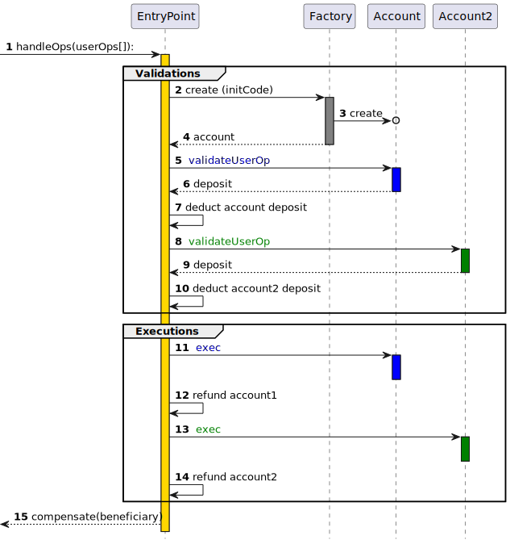

# ZKsync Era Account Abstraction

## EIP-4337

### EOA vs CA

以太坊原生的两类账户：

- EOA (Externally Owned Account 外部账户): 由任何拥有私钥的人控制
- CA (Contract Account 合约账户): 部署到网络上的智能合约，由代码控制

EOA 与 CA 最大的区别在于，EOA 可以作为交易发起者，而 Contract 都只能是交易的中继者，即只能被动的触发交易。当一个 Contract Account 想要给另一个地址转账，就必须由一个 EOA 账户作为交易发起者，触发 Contract 的相关函数完成交易。


对于普通用户而言 EOA 账户最大的问题在于密钥的丢失意味着失去了一切账户资产和控制权，另外 EOA 的验证只能使用 ESDSA 签名算法，以及只能使用 ETH 作为 gas 等缺点。


### EIP-4337 overview

[EIP-4337](https://eips.ethereum.org/EIPS/eip-4337) 是 Vitalik 提出的账户抽象实现标准，也是目前大部分账户抽象实现的模式。该提案旨在不对现有共识层修改的条件下，在更高层级实现账户抽象，具备以下优势：

- 多重签名和社交恢复
- 更高效、更简单的签名算法（例如 Schnorr、BLS）
- 可以使用抗量子安全签名算法（例如 Lamport、Winternitz）
- 可升级性

> 在 EIP-4337 之前， EIP-2938 曾试图解决类似的问题，但引入了对以太坊共识层的修改。

#### How EIP-4337 works

其工作原理类似于交易内存池 (Mempool)，用户发送将 `UserOperation` 用户意图与签名和其他数据打包在一起的对象以进行验证。使用 Bundler 提供的服务可以将一组`UserOperation` 对象打包成单个“bundle transaction (捆绑交易)”，然后将其包含到以太坊区块中。


Bundler 以 ETH 支付捆绑交易的 gas 费用，并通过作为所有单独 UserOperation 执行的一部分支付的费用获得补偿。Bundler 将 UserOperation 选择要包含的对象（比如与矿工在现有交易内存池中操作方式类似的费用优先级逻辑）。 `UserOperation` 看起来像是一笔交易，包含:

- `sender`：发起该操作的的账户地址
- `nonce and signature`：传递到 AA 钱包验证函数的参数，以便 AA 钱包可以验证操作
- `initCode`：如果 AA 钱包尚不存在，则用于创建钱包的初始化代码
- `callData`：在实际执行步骤中调用钱包的数据

AA 钱包是一个智能合约，需要具备两个主要功能：

- `validateUserOp`，它接受 `UserOperation` 作为输入。该函数的作用是验证 `UserOperation` 的 `nonce` 和 `signature`，如果验证成功则支付费用并增加 `nonce` ，如果验证失败则抛出异常。
- `execution function`，解析 calldata 作为 AA 钱包的操作指令，并执行。

为了简化 AA 钱包的逻辑，确保安全等的许多复杂的智能合约逻辑不会包含其中，而是在称为 `EntryPoint` 的全局合约中。

而在 AA 钱包中，将通过 `require(msg.sender == ENTRY_POINT)` 的简单检查来保证安全性，因此只有受信任的 `EntryPoint` 才能调用 AA 钱包执行任何操作或支付费用。`EntryPoint` 只在 `validateUserOp` 验证成功后调用 `UserOperation`，因此这足以保护 AA 钱包免受攻击。另外如果 AA 钱包尚不存在，`EntryPoint` 还负责使用提供的 `initCode` 创建 AA 钱包。


综合以上思路，我们可以得出一个抽象账户实现基本的流程图：



**发起调用阶段**

- 1 `sender` (通常是 Bundler) 打包发送 `userOps` 给 `EntryPoint`

**验证阶段** `EtnryPoint` 会批量验证 Bundle Transaction 内的所有 `UserOps` (多个用户的多笔操作)

- 2 (3,4) 如果属于用户 1 的 AA 钱包 1 不存在，`EtnryPoint` 会调用 `Factory` 创建 AA 钱包
- 5 `EtnryPoint` 调用用户 1 的 AA 钱包 1 `validateUserOp` 函数验证该操作是否合法
- 6 AA 钱包 1 在 `EtnryPoint` 中存入 ETH 以支付接下来的操作产生的 gas
- 7 `EtnryPoint` 扣除 AA 钱包 1 的 gas 费用
- 8 `EtnryPoint` 调用用户 2 的 AA 钱包 2 `validateUserOp` 函数验证该操作是否合法
- 9 AA 钱包 2 在 `EtnryPoint` 中存入 ETH 以支付接下来的操作产生的 gas
- 10 `EtnryPoint` 扣除 AA 钱包 2 的 gas 费用

**执行阶段**

- 11 调用 AA 钱包 1 的 exec 函数执行用户 1 的操作
- 12 为 AA 钱包 1 执行 refund（退回多余的 gas 费用）
- 13 调用 AA 钱包 2 的 exec 函数执行用户 1 的操作
- 14 为 AA 钱包 2 执行 refund（退回多余的 gas 费用）

**完成阶段**

- 15 完成所有调用，补偿受益人（可能是 Bundler 的维护者）

#### Paymaster(EIP-4337)

在上述流程中，用户仍然必须拥有足够的 ETH 来支付费用，而很多场景下，用户往往希望用其他方式支付费用，于是便有了 Paymaster 这个角色，可以代替用户使用 ETH 支付 gas 费用。我们需要 Paymaster 具备两个主要功能：

- 允许第三方代表用户支付费用
- 允许用户以 ERC20 token (非 ETH 资产)支付费用，以合约作为媒介收取 ERC20 并以 ETH 支付

Paymaster 需要验证两个条件：

- 验证 sponsor 的签名，如果验证通过 Paymaster 将接受 UserOps 并为此支付费用。
- 验证 `sender` 钱包是否有足够的 ERC20 余额可用于支付 gas 费用。


那么包含 Paymster 的完整流程如下：

1. 发送 `UserOps` 到 `EntryPoint`
2. `EntryPoint` 调用 AA 钱包的 `validateUserOp` 验证操作是否合法
3. `EntryPoint` 调用 Paymaster 的 `validatePaymasterUserOp` 验证 Paymaster 是否愿意为该操作支付费用
4. `EntryPoint` 扣除 Paymaster 的存款作为 gas 费用
5. `EntryPoint` 调用 AA 钱包的 `exec` 执行操作
6. `EntryPoint` 调用 Paymaster 的 `postOp` 函数（该函数由 Paymaster 自定义，通常用户更新状态，广播 event 等等）
7. refund paymster 退还 Paymaster 多余的费用

## AA Mechanism in ZKsync Era

ZKsync Era 上的账户抽象协议 (以下简称 Native AA) 与 EIP-4337 非常相似，但将一部分功能集成到系统中，优化用户体验和效率。

Native AA 中的组成:

- `bootloader`: System Contract(系统合约)，主要功能是处理用户的操作交易(userOps)，对应 EIP-4337 中的 `EntryPoint` 合约。`bootloader` 只能被系统调用，无法被外部使用者调用。
- `NonceHolder`: System Contract(系统合约)，该合约存储账户 nonce 值，以及修改 nonce (通常调用 `incrementMinNonceIfEquals` 函数)。
- `AAccount`: 继承 `IAcount` 接口的 AA 钱包合约，可以自定义实现，但必须实现规定的接口:
  - `validateTransaction` 必须实现
  - `executeTransaction` 必须实现
  - `payForTransaction` 和 `prepareForPaymaster` 必须至少实现 1 个
  - `executeTransactionFromOutside` 非必须，但强烈建议实现
- Paymaster: 继承 `IPaymaster` 接口的合约，可以自定义实现，但必须实现规定的接口:
  - `validateAndPayForPaymasterTransaction` 必须实现，用以确认 paymaster 是否原因承担该交易的费用
  - `postTransaction` 可选实现，在操作交易完成后 `bootloader` 会调用此方法
- `AAFactory`: 可选实现，用于创建自定义 AA 钱包 的工厂合约；

> **在 ZKsync 上，每个地址都是一个合约**。用户可以从他们的 EOA 账户开始交易，因为每个没有部署任何合约的地址都**隐式包含 DefaultAccount.sol(系统合约)** 中定义的代码。每当有人调用不在 `kernel space` (内核空间 即地址 ≥2^16) 且没有部署任何合约代码的合约时， 的代码 DefaultAccount 将被用作合约的代码。

### Native AA transaction flow


**初始化自定义 AA 钱包**

如果需要实现自定义 AA 钱包逻辑，那么就需要实现一个工厂合约来部署 `AAccount` 合约。

1. 调用 `AAFactory.deployAccount()` 函数，触发 AA 钱包的初始化(部署合约)
2. `AAFactory` 调用系统合约 `ContractDeployer` 的 `create2Account` 函数部署新的 `AAccount` 合约
3. 系统合约 `ContractDeployer` 创建 `AAccount` 合约
4. 系统合约 `ContractDeployer` 将新合约地址返回给 `AAFactory`

**验证阶段**

用户向网络中广播 Native AA 操作请求(没有支付 gas)，zksync Era 系统会自动触发 `AAccount` 的相关方法

1. `AAccount` 调用系统合约 `NonceHolder` 中的方法检查 AAccount 的 nonce，并更新（ 通常调用 `incrementMinNonceIfEquals` 函数）
2. `AAccount.validateTransaction` 验证操作的合法性
3. 系统合约 `BootLoader` 将新的 nonce 标记为已使用；`AAccount` 检查余额是否足够支付 gas，用户签名是否正确
4. 支付 gas 费用，将有两种方式：
   a. `AAccount` 直接支付 gas 费用，`BootLoader` 调用 `AAccount.payForTransaction` 函数
   b. 委托 `Paymaster` 代为支付 gas 费用
   - `BootLoader` 调用 `AAccount.prepareForPaymaster` 函数(如果涉及 ERC20 支付费用，这里会调用 `ERC20.approve` 授权给 paymaster 转走 token);
   - `BootLoader` 调用 `Paymaster.validateAndPayForPaymasterTransaction` 函数，这里将实现验证交易和向 `BootLoader` 支付 gas 费用的逻辑，例如 `transferFrom` ERC20 token，并向 `BootLoader` 转账 ETH
5. `BootLoader` 检查收到的 ETH 数额是否足以支付 gas 费用

**执行阶段**

6. `BootLoader` 调用 `AAccount.executeTransaction` 执行操作
7. 如果使用了 Paymaster 支付费用，操作执行成功后 `BootLoader` 调用 `Paymaster.postTransaction` 函数

### ZKsync Native AA vs EIP-4337

| Comparison               | ZKsync Native AA          | EIP-4337                        | Starknet                  |
| ------------------------ | ------------------------- | ------------------------------- | ------------------------- |
| Defined in               | Protocol + contract level | contract level                  | Protocol + contract level |
| Trigger Verify & Execute | Operator + bootloader     | Bundler → EntryPoint            | Sequencer                 |
| Determine Tx order       | Sequencer                 | Bundler                         | Sequencer                 |
| Send Tx before deploy    | yes, with DefaultAccount  | yes, with initCode              | no                        |
| Dev. Threshold           | Low (contract)            | Medium (bundler SDK + contract) | Low (contract)            |
| SHOULD Limit Caller      | only Bootloader           | only EntryPoint                 | only Sequencer            |
| Validate Function        | validateTransaction       | validateUserOp                  | --                        |
| Execute Function         | executeTransaction        | executeUserOp                   | --                        |

### Fee Model and Paymaster

在 EIP-4337 中，有三种类型的 Gas 限制，它们描述了不同步骤的 Gas 限制:

- `verificationGasLimit` 验证操作所需的 gas 费用限制
- `callGasLimit` 执行操作所需的 gas 费用限制
- `preVerificationGas` 额外向 Bundler 支付的 gas 费用

而在 ZKsync Era Native AA 只有一个字段 ，`gasLimit` 涵盖了所有三个字段的费用。提交交易时，请确保 gasLimit 足以支付验证、支付费用（上面提到的 ERC20 转账）以及实际执行本身。

#### Built-in paymaster flows

##### General paymaster flow

如果 Paymaster 无需用户事先采取行动即可进行操作(例如用户提前支付了费用)，则应使用该方法。`paymasterInput` 字段必须编码为对具有以下接口的函数的调用：

```solidity
function general(bytes calldata data);
```

##### Approval-based paymaster flow

如果 Paymaster 需要从 AAccount 中拉取 ERC20 作为费用，则向 `paymasterInput` 字段传入：

```solidity
function approvalBased(
    address _token,
    uint256 _minAllowance,
    bytes calldata _innerInput
)
```

## Dive into Native AA with custom-paymaster

接下来我们将以 [custom-paymaster](../Lesson01/custom-paymaster/) 为例，深入探究在 Native AA 调用过程中，究竟发生了什么，Paymaster 合约 和 zksync Era 系统合约将如何参与整个过程。

假设我们有一个 ZKsync Era EOA 账户，因为缺少作为 gas 费用的 ETH，所以使用一个 custom-paymaster 合约代替我们支付 gas。

### step 0

虽然 EOA 账户没有 gas，但是依旧可以在交易信息 `customData` 中添加 `paymasterParams` 字段，zksync-ehters 会自动告诉网络这是一笔 Native AA 类型的交易，系统合约将尝试向指定的 Paymaster 收取 gas 费用，而不是你的 EOA 账户。

```ts
// custom-paymaster/deploy/use-paymaster.ts
import { utils, Wallet } from "zksync-ethers";

const mintTx = await erc20.mint(wallet.address, 5, {
  // paymaster info
  customData: {
    paymasterParams: utils.getPaymasterParams(PAYMASTER_ADDRESS, {
      type: "ApprovalBased",
      token: TOKEN_ADDRESS,
      // set minimalAllowance as we defined in the paymaster contract
      minimalAllowance: BigInt("1"),
      // empty bytes as testnet paymaster does not use innerInput
      innerInput: new Uint8Array(),
    });,
    gasPerPubdata: utils.DEFAULT_GAS_PER_PUBDATA_LIMIT,
  },
});
```

`utils.getPaymasterParams` 是 zksync-ethers 中提供的组装 paymaster 调用的方法，处理后的数据是这样：

- `paymaster` paymaster 合约地址
- `paymasterInput` 是组装后的 calldata，在这里我们选择使用 ERC20 付费给 Paymaster 的模式，如果选择其他模式则将编码为 `function general(bytes calldata data)`

```ts
paymasterParams: {
  // paymaster 合约地址
  paymaster: '0xaAF5f437fB0524492886fbA64D703df15BF619AE',
  // function approvalBased(address _token,uint256 _minAllowance,bytes calldata _innerInput)
  paymasterInput: '0x949431dc00000000000000000000000099e12239cbf8112fbb3f7fd473d0558031abcbb5000000000000000000000000000000000000000000000000000000000000000100000000000000000000000000000000000000000000000000000000000000600000000000000000000000000000000000000000000000000000000000000000'
}
```

zksync-ethers 会自动将交易的 [`transaction_type`](https://docs.zksync.io/zk-stack/concepts/transaction-lifecycle.html#transaction-types) 字段赋值为 113，这代表该交易是 `EIP-712` 类型交易，该类型的交易会进一步处理，解析其中的字段信息和验证签名。我们在 spend-limit 示例中手动构建过 Native AA 交易，其中就直接赋值了 type 为 113。

> 由于 `transaction_type` 字段长度是 1 byte，所以不能使用 712，而规定为 113。

```ts
// spend-limit/deploy/transferETH.ts
import { utils, EIP712Signer } from "zksync-ethers";

let ethTransferTx = {
  from: DEPLOYED_ACCOUNT_ADDRESS,
  to: RECEIVER_ACCOUNT, // account that will receive the ETH transfer
  chainId: (await provider.getNetwork()).chainId,
  nonce: await provider.getTransactionCount(DEPLOYED_ACCOUNT_ADDRESS),
  type: 113, // transaction_type
  customData: {
    gasPerPubdata: utils.DEFAULT_GAS_PER_PUBDATA_LIMIT,
  } as types.Eip712Meta,
  value: ethers.parseEther(transferAmount),
  data: "0x",
} as types.Transaction;

ethTransferTx.gasPrice = await provider.getGasPrice();
ethTransferTx.gasLimit = await provider.estimateGas(ethTransferTx);

// 根据 EIP-712 规范，对 txHash 进行签名，`bootloader` 中会对此验证
const signedTxHash = EIP712Signer.getSignedDigest(ethTransferTx);
const signature = ethers.concat([
  ethers.Signature.from(owner.signingKey.sign(signedTxHash)).serialized,
]);

ethTransferTx.customData = {
  ...ethTransferTx.customData,
  customSignature: signature,
};
```

### step 1

当交易被广播之后，首先交由系统合约 `bootloader` 处理，在验证交易阶段，会调用 `from` 的 `validateTransaction` 函数。

```ts
// system-contract/bootloader.yul
// flow of Native AA tx with paymaster
processTx(txdata...)
    |__ processL2Tx(txdata...)
        |__ l2TxValidation(...)
        |   |__ ZKSYNC_NEAR_CALL_validateTx(...)
        |       |__ accountValidateTx()
        |       |   |__ callAccountMethod("validateTransaction")
        |       |__ ensurePayment(txDataOffset, gasPrice)
        |           |__ accountPayForTx() // no paymaster
        |           |   |__ callAccountMethod("payForTransaction")
        |           |__ accountPrePaymaster() // with paymaster
        |           |   |__ callAccountMethod("prepareForPaymaster")
        |           |__ validateAndPayForPaymasterTransaction()
        |               |__ callAccountMethod("validateAndPayForPaymasterTransaction")
        |__ l2TxExecution(...)
            |__ l2TxExecution(...)
            |   |__ ZKSYNC_NEAR_CALL_executeL2Tx(...)
            |       |__ executeL2Tx()
            |           |__ callAccountMethod("executeTransaction")
            |__ refundCurrentL2Transaction()
                |__ ZKSYNC_NEAR_CALL_callPostOp()
                    |__ call("postTransaction")

```

此时大家可能会疑惑，如果是在 spend-limit 中，`from` 是 AA 钱包 合约，其中包含 `validateTransaction` 接口，那么调用不会有问题，但是在 custom-paymaster 示例中，`from` 是一个 EOA 类型账户，在其上调用接口是否会报错？

这里就需要介绍 [DefaultAccount](https://docs.zksync.io/zk-stack/components/smart-contracts/system-contracts.html#defaultaccount) ，事实上 EOA 账户可以默认为继承 DefaultAccount 的智能合约。每当账户**不满足**以下条件时：

- 属于 kernel space (内核空间)
- 上面部署了任何代码（相应存储槽下存储的值 AccountCodeStorage 为零）

该账户将使用 `DefaultAccount` 的代码。所以在 custom-paymaster 示例中，`bootloader` 将调用 `DefaultAccount.validateTransaction` 函数来验证 AA 交易。

```solidity
// system-contracts/contracts/DefaultAccount.sol

contract DefaultAccount is IAccount {
    ...

    function _validateTransaction(
        bytes32 _suggestedSignedHash,
        Transaction calldata _transaction
    ) internal returns (bytes4 magic) {
        // Note, that nonce holder can only be called with "isSystem" flag.
        SystemContractsCaller.systemCallWithPropagatedRevert(
            uint32(gasleft()),
            address(NONCE_HOLDER_SYSTEM_CONTRACT),
            0,
            abi.encodeCall(INonceHolder.incrementMinNonceIfEquals, (_transaction.nonce))
        );
        ...
    }
}
```

在 `validateTransaction` 函数中，必须要调用 `NonceHolder.incrementMinNonceIfEquals` 或者其他更新账户 nonce 值的方法。nonce 不一定必须是单调递增的，但建议调用 `incrementMinNonceIfEquals` 函数使其单调递增，在交易执行完字后新的 nonce 将被标记为已使用状态。

```solidity
// system-contracts/contracts/NonceHolder.sol
contract NonceHolder is INonceHolder, ISystemContract {
  ...
  /// @notice A convenience method to increment the minimal nonce if it is equal
  /// to the `_expectedNonce`.
  /// @param _expectedNonce The expected minimal nonce for the account.
  function incrementMinNonceIfEquals(uint256 _expectedNonce) external onlySystemCall {
      uint256 addressAsKey = uint256(uint160(msg.sender));
      uint256 oldRawNonce = rawNonces[addressAsKey];

      (, uint256 oldMinNonce) = _splitRawNonce(oldRawNonce);
      require(oldMinNonce == _expectedNonce, "Incorrect nonce");

      unchecked {
          rawNonces[addressAsKey] = oldRawNonce + 1;
      }
  }
}
```

### step 2

在 nonce 更新后，会对 Native AA 的交易验证

1. 生成 txHash，参考 `TransactionHelper.encodeHash`，这里会按照 EIP-712 的规范生成
2. 计算该交易所需的 gas 费用，参考 `TransactionHelper.totalRequiredBalance`，分两类情况
   a. 如果指定了 paymaster，则此处返回 `tx.value` 即不向 `from` 收取 gas 费用
   b. 如果没有指定 paymaster，则 `requiredBalance = maxFeePerGas * gasLimit + tx.value`
3. 通过 `ecrecover` 验证 txHash 与 `_transaction.signature` 是否匹配

```solidity
// system-contracts/contracts/DefaultAccount.sol
import "./libraries/TransactionHelper.sol";

contract DefaultAccount is IAccount {
    using TransactionHelper for *;

    ...

    function _validateTransaction(
        bytes32 _suggestedSignedHash,
        Transaction calldata _transaction
    ) internal returns (bytes4 magic) {
        ...

        // Even though for the transaction types present in the system right now,
        // we always provide the suggested signed hash, this should not be
        // always expected. In case the bootloader has no clue what the default hash
        // is, the bytes32(0) will be supplied.
        bytes32 txHash = _suggestedSignedHash != bytes32(0) ? _suggestedSignedHash : _transaction.encodeHash();

        // The fact there is are enough balance for the account
        // should be checked explicitly to prevent user paying for fee for a
        // transaction that wouldn't be included on Ethereum.
        uint256 totalRequiredBalance = _transaction.totalRequiredBalance();
        require(totalRequiredBalance <= address(this).balance, "Not enough balance for fee + value");

        if (_isValidSignature(txHash, _transaction.signature)) {
            magic = ACCOUNT_VALIDATION_SUCCESS_MAGIC;
        }
    }
}
```

### step 3

在 `validateTransaction` 通过后会, `bootloader` 通过 `ensureNonceUsage` 方法使 account nonce 标记为已使用

### step 4

进入 `bootloader.ensurePayment` 收取 gas 费用

- 如果没有指定 paymaster 将直接从 `from` 账户扣除 gas 费用 + `tx.value`;
  - `bootloader.accountPayForTx` 方法会调用 AAccount 的 `payForTransaction` 方法收取费用
- 如果有指定 paymaster 则:

1. `bootloader` 调用 AAccount (DefaultAccount) 的 `prepareForPaymaster` 函数，目前只有两种模式，其他情况则会 revert
   a. `approvalBased` 模式，需要 `ERC20.approve` 操作，授权给 paymaster
   b. `general` 模式，不会做任何操作

```solidity
import "./libraries/TransactionHelper.sol";

contract DefaultAccount is IAccount {
    using TransactionHelper for *;
    ...
    function prepareForPaymaster(
        bytes32, // _txHash
        bytes32, // _suggestedSignedHash
        Transaction calldata _transaction
    ) external payable ignoreNonBootloader ignoreInDelegateCall {
        _transaction.processPaymasterInput();
    }
}

library TransactionHelper {
    ...
    function processPaymasterInput(Transaction calldata _transaction) internal {
        require(_transaction.paymasterInput.length >= 4, "The standard paymaster input must be at least 4 bytes long");

        bytes4 paymasterInputSelector = bytes4(_transaction.paymasterInput[0:4]);
        if (paymasterInputSelector == IPaymasterFlow.approvalBased.selector) {
            require(
                _transaction.paymasterInput.length >= 68,
                "The approvalBased paymaster input must be at least 68 bytes long"
            );

            // While the actual data consists of address, uint256 and bytes data,
            // the data is needed only for the paymaster, so we ignore it here for the sake of optimization
            (address token, uint256 minAllowance) = abi.decode(_transaction.paymasterInput[4:68], (address, uint256));
            address paymaster = address(uint160(_transaction.paymaster));

            uint256 currentAllowance = IERC20(token).allowance(address(this), paymaster);
            if (currentAllowance < minAllowance) {
                // Some tokens, e.g. USDT require that the allowance is firsty set to zero
                // and only then updated to the new value.

                IERC20(token).safeApprove(paymaster, 0);
                IERC20(token).safeApprove(paymaster, minAllowance);
            }
        } else if (paymasterInputSelector == IPaymasterFlow.general.selector) {
            // Do nothing. general(bytes) paymaster flow means that the paymaster must interpret these bytes on his own.
        } else {
            revert("Unsupported paymaster flow");
        }
    }
}
```

2. `bootloader` 调用 paymaster 的 `validateAndPayForPaymasterTransaction` 函数，paymaster 会先检查 token 授权额度是否充足，然后从 account 中拉取 ERC20，最后向 `bootloader` 支付 ETH (包含 tx.value)

```solidity

contract MyPaymaster is IPaymaster {
    ...
    function validateAndPayForPaymasterTransaction(
        bytes32,
        bytes32,
        Transaction calldata _transaction
    )
        external
        payable
        onlyBootloader
        returns (bytes4 magic, bytes memory context)
    {
        // By default we consider the transaction as accepted.
        magic = PAYMASTER_VALIDATION_SUCCESS_MAGIC;
        require(
            _transaction.paymasterInput.length >= 4,
            "The standard paymaster input must be at least 4 bytes long"
        );

        bytes4 paymasterInputSelector = bytes4(
            _transaction.paymasterInput[0:4]
        );
        if (paymasterInputSelector == IPaymasterFlow.approvalBased.selector) {
            // While the transaction data consists of address, uint256 and bytes data,
            // the data is not needed for this paymaster
            (address token, uint256 amount, bytes memory data) = abi.decode(
                _transaction.paymasterInput[4:],
                (address, uint256, bytes)
            );

            // Verify if token is the correct one
            require(token == allowedToken, "Invalid token");

            // We verify that the user has provided enough allowance
            address userAddress = address(uint160(_transaction.from));

            address thisAddress = address(this);

            uint256 providedAllowance = IERC20(token).allowance(
                userAddress,
                thisAddress
            );
            require(
                providedAllowance >= PRICE_FOR_PAYING_FEES,
                "Min allowance too low"
            );

            // Note, that while the minimal amount of ETH needed is tx.gasPrice * tx.gasLimit,
            // neither paymaster nor account are allowed to access this context variable.
            uint256 requiredETH = _transaction.gasLimit *
                _transaction.maxFeePerGas;

            try
                IERC20(token).transferFrom(userAddress, thisAddress, amount)
            {} catch (bytes memory revertReason) {
                // If the revert reason is empty or represented by just a function selector,
                // we replace the error with a more user-friendly message
                if (revertReason.length <= 4) {
                    revert("Failed to transferFrom from users' account");
                } else {
                    assembly {
                        revert(add(0x20, revertReason), mload(revertReason))
                    }
                }
            }

            // The bootloader never returns any data, so it can safely be ignored here.
            (bool success, ) = payable(BOOTLOADER_FORMAL_ADDRESS).call{
                value: requiredETH
            }("");
            require(
                success,
                "Failed to transfer tx fee to the bootloader. Paymaster balance might not be enough."
            );
        } else {
            revert("Unsupported paymaster flow");
        }
    }
}
```

### step 5

`bootloader` 检查收到的 ETH 是否大于等于交易所需的 ETH，如果检查通过，返还多余的 ETH，下面将进入执行交易阶段

### step 6

`bootloader` 调用 account (DefaultAccount) 的 `executeTransaction` 函数，执行交易操作

1. 提取交易数据 `to`, `value`, `data`, `gas`
2. 检查是否为创建合约的操作，若是则 `isSystemCall` 为 true
3. 执行 call 调用

```solidity
// system-contracts/contracts/DefaultAccount.sol
import "./libraries/TransactionHelper.sol";

contract DefaultAccount is IAccount {
    using TransactionHelper for *;
    ...

    /// @notice Method called by the bootloader to execute the transaction.
    /// @param _transaction The transaction to execute.
    /// @dev It also accepts unused _txHash and _suggestedSignedHash parameters:
    /// the unique (canonical) hash of the transaction and the suggested signed
    /// hash of the transaction.
    function executeTransaction(
        bytes32, // _txHash
        bytes32, // _suggestedSignedHash
        Transaction calldata _transaction
    ) external payable override ignoreNonBootloader ignoreInDelegateCall {
        _execute(_transaction);
    }

    function _execute(Transaction calldata _transaction) internal {
        address to = address(uint160(_transaction.to));
        uint128 value = Utils.safeCastToU128(_transaction.value);
        bytes calldata data = _transaction.data;
        uint32 gas = Utils.safeCastToU32(gasleft());

        // Note, that the deployment method from the deployer contract can only be called with a "systemCall" flag.
        bool isSystemCall;
        if (to == address(DEPLOYER_SYSTEM_CONTRACT) && data.length >= 4) {
            bytes4 selector = bytes4(data[:4]);
            // Check that called function is the deployment method,
            // the others deployer method is not supposed to be called from the default account.
            isSystemCall =
                selector == DEPLOYER_SYSTEM_CONTRACT.create.selector ||
                selector == DEPLOYER_SYSTEM_CONTRACT.create2.selector ||
                selector == DEPLOYER_SYSTEM_CONTRACT.createAccount.selector ||
                selector == DEPLOYER_SYSTEM_CONTRACT.create2Account.selector;
        }
        bool success = EfficientCall.rawCall(gas, to, value, data, isSystemCall);
        if (!success) {
            EfficientCall.propagateRevert();
        }
    }
}
```

### step 7

如果该交易使用了 paymaster ，`bootloader` 调用 paymaster `postTransaction` 函数，这里 paymaster 可以做自定义操作，比如发送交易完成的 event，便于链下服务监听。

## Estimating gas when interacting with a paymaster

虽然 paymaster 为用户支付费用，但与正常交易相比，它也会消耗额外的 Gas，其中包括：

1. paymaster 内部的计算 `validateAndPayForPaymasterTransaction` 以及 `postTransaction` (可以忽略不计)
2. Paymaster 将资金发送到 `bootloader` (transfer)
3. 用户为 paymaster 做 ERC20 approve 操作

> 1)的消耗可以忽略不计，2) 是固定的转账费用，而 3) 当存储槽从零变为一个新的非零值时，是一个相对昂贵的操作。这是因为 Ethereum 的存储模型对修改空白存储槽和更新已有存储槽的费用是不同的。数据写入成本：首次写入一个存储槽需要消耗大约 20000 gas。考虑到 L1 网络中 gas 的价格（例如 50 gwei），这种操作的成本可以非常高。

如何正确预估一笔使用 paymaster 的 AA 交易费用，对于应用程序来说至关重要。

```ts
import { utils } from "zksync-ethers";

// Encoding the "ApprovalBased" paymaster flow's input
const paymasterParams = utils.getPaymasterParams(PAYMASTER_ADDRESS, {
  type: "ApprovalBased",
  token: TOKEN_ADDRESS,
  // set minimalAllowance as we defined in the paymaster contract
  minimalAllowance: BigInt("1"),
  // empty bytes as testnet paymaster does not use innerInput
  innerInput: new Uint8Array(),
});
const gasLimit = await erc20.estimateGas.mint(wallet.address, 5, {
  customData: {
    gasPerPubdata: utils.DEFAULT_GAS_PER_PUBDATA_LIMIT,
    paymasterParams: paymasterParams,
  },
});
```

在 custom-paymaster 中，为了简化示例，我们直接设定每一次调用费用是 1 ERC20，实际情况显然要复杂很多。例如用户的账户上有 100 ERC20 token，希望让 paymaster 代为支付 gas，将所有 token 转走，费用从 token 数量里扣除。这个时候我们想要预估 `gaslimit` 无疑将陷入鸡生蛋还是蛋生鸡的问题中：我们需要确定的转账数量才能确定 `gaslimit`, 但在确定转账数量之前，我们需要先确定 `gaslimit` ...

这里有两个建议：

1. 对于一笔交易可以有个粗略的 gas 费用估计，比如转账操作平均成本在 10 token，但用户想要转出 95 token，显然是不可行的。
2. 先预估不使用 paymaster 完成该操作需要多少费用，然后在其基础上加上一个固定的 paymaster 费用

## Reference

- [ZKsync Era Doc](https://docs.zksync.io/build/developer-reference/account-abstraction.html)
- [ERC-4337](https://eips.ethereum.org/EIPS/eip-4337)
- [ERC 4337: account abstraction without Ethereum protocol changes](https://medium.com/infinitismerc-4337-account-abstraction-without-ethereum-protocol-changes-d75c9d94dc4a)
- [DL 分享视频 AA workshop](https://space.bilibili.com/2145417872/channel/collectiondetail?sid=1974263)
- [Account Abstraction 介紹（一）：以太坊的帳戶現況](https://medium.com/imtoken/account-abstraction-%E4%BB%8B%E7%B4%B9-%E4%B8%80-%E4%BB%A5%E5%A4%AA%E5%9D%8A%E7%9A%84%E5%B8%B3%E6%88%B6%E7%8F%BE%E6%B3%81-6c03c303f229)
- [Account Abstraction 介紹（二）：以太坊未來的帳戶體驗](https://medium.com/imtoken/account-abstraction-%E4%BB%8B%E7%B4%B9-%E4%BA%8C-%E4%BB%A5%E5%A4%AA%E5%9D%8A%E6%9C%AA%E4%BE%86%E7%9A%84%E5%B8%B3%E6%88%B6%E9%AB%94%E9%A9%97-cca0380d3ba5)
