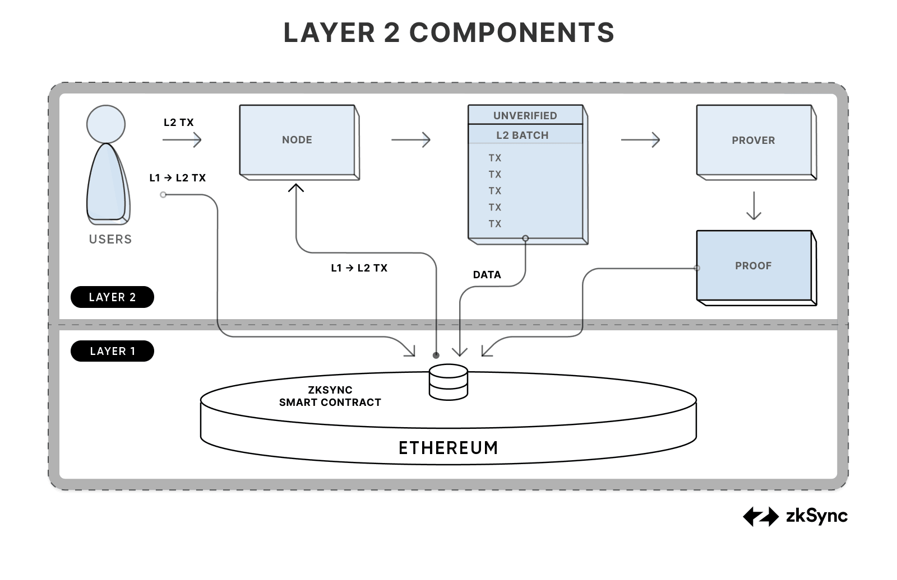
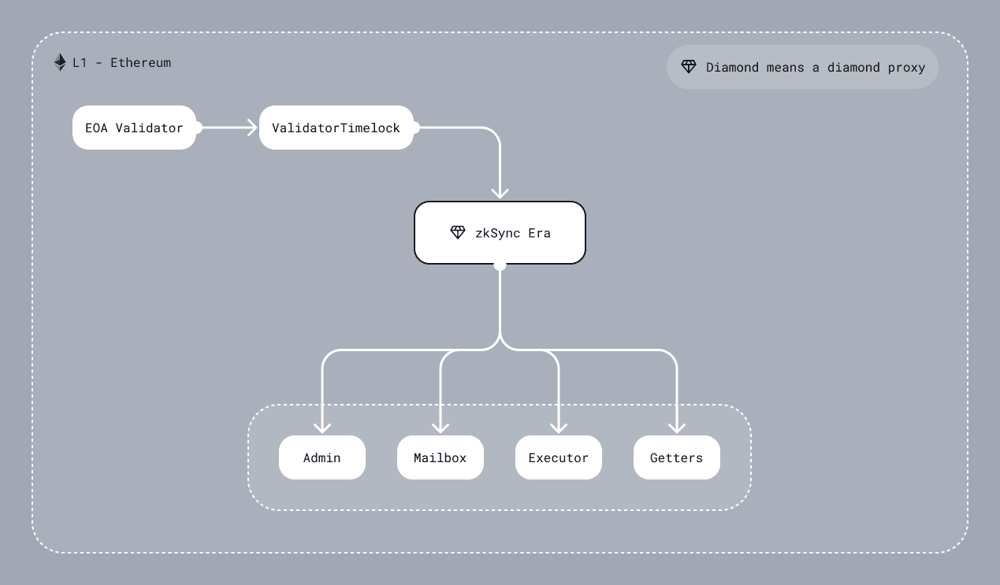

# ZKsync Era System Contracts, Fee Model And Ethereum Difference



## L1 contracts

ZKsync Era 钻石合约的几个模块包括：

1. DiamondProxy: 这是钻石合约的代理模块，负责接收外部调用并将其委托给正确的功能模块（Facet）进行处理。
2. AdminFacet: 负责管理钻石合约的各个模块，主要包括合约的升级、模块的添加和删除等操作。
3. MailboxFacet 处理 L1 <-> L2 的通信
4. ExecutorFacet: 执行特定的系统交易和操作逻辑，确保在 ZKsync 系统中高效处理交易。
5. GettersFacet: 独立的 facet，它的唯一功能是提供 `view` 和 `pure` 方法
6. GovernanceFacet: 与治理相关的功能模块，负责合约的治理操作，如投票和提案处理等。
7. ValidatorFacet: 功能：涉及验证逻辑，用于检查和验证关键的操作和状态。这一模块是确保系统安全性的重要部分。

### Diamond Contract（钻石合约）

钻石合约（Diamond Contract, 又称 State Transition Contract），是一种特殊的智能合约结构，它允许单个合约包含多个逻辑模块，每个模块都被称为“Facet”。这种设计极大地增强了合约的灵活性和可扩展性，使得我们可以在不需要部署新的合约的情况下，动态地添加或修改功能。



钻石合约的核心优势在于：

- 模块化设计：通过将不同功能模块化，可以有效管理和扩展合约的功能。
- 节省 Gas 费用：在扩展合约功能时，无需重新部署整个合约，从而节省了 Gas 费用。

#### DiamondProxy

在钻石合约中，DiamondProxy 是一个关键组件，它负责将外部调用代理到正确的 Facet 模块。`DiamondProxy` 的结构允许我们通过更新一个存储在合约中的地址来动态地改变功能指向的逻辑模块，从而实现灵活的功能扩展和维护。

通过 `delegatecall` 操作将调用委派到特定的 Facet 模块，这使得主合约可以动态地更新或添加新功能而无需改变其接口或地址。

> 代理合约模式适用于简单的合约升级，而钻石合约模式则提供更强的模块化和灵活性，适合复杂的合约系统。

### AdminFacet

这个 facet 负责配置设置和可升级性，处理的任务包括：

- **特权地址管理**：更新关键角色，包括 governor 和验证者。
- **系统参数配置**：调整关键系统设置，例如 L2 bootloader 字节码哈希、验证者地址、验证者参数、费用配置等。
- **冻结能力**：在升级期间或响应检测到的漏洞时，通过 diamond proxy 执行 facets 的冻结/解冻操作，以保障生态系统的安全。

对 AdminFacet 的控制分为两个主要实体：

- **STM (State Transition Manager)**：一个独立的智能合约，可以对系统进行关键性更改作为协议升级的一部分。尽管目前只有一个版本的 STM 存在，但该架构允许通过后续升级引入未来版本。STM 的控制权由 `Governance.sol` 合约和 Admin 实体（见下文）共享。`Governance.sol` 由两个 multisig 控制：Admin multisig（见下文）和 Security council multisig（加密领域的受人尊敬的贡献者）。合作完成后，这些实体有权执行即时升级，而 Matter Labs 仅限于调度升级。

- **Admin**：由 Matter Labs 管理的 multisig 智能合约，可以对系统执行非关键性更改，例如授予验证者权限。需要注意的是，Admin 是唯一拥有治理权的 multisig。

### MailboxFacet

处理 L1 <-> L2 的通信。

Mailbox 执行以下三个功能：

- **L1 <-> L2 Communication**：支持数据和交易请求从 L1 发送到 L2，反之亦然，支持多层协议的实现。
- **Bridging Native Tokens**：允许将 ether 或 ERC20 代币桥接到 L2，使用户能够在 L2 生态系统中使用这些资产。
- **Censorship Resistance Mechanism**：目前处于研究阶段。

L1->L2 的通信通过在 L1 上请求 L2 交易并在 L2 上执行来实现。这意味着用户可以调用 L1 合约上的函数来保存关于交易的信息到某个队列中。稍后，验证者可以在 L2 上处理它，并在 L1 优先队列中标记为已处理。目前，它用于从 L1 向 L2 发送信息或实现多层协议。用户在请求 L1->L2 交易时，以 Native token (ETH)支付交易执行费用。

**注意**：当用户从 L1 请求交易时，在 L2 上发起的交易将具有特别 `msg.sender` 。

```solidity
address sender = msg.sender;
if (sender != tx.origin) {
    sender = AddressAliasHelper.applyL1ToL2Alias(msg.sender);
}

uint160 constant offset = uint160(0x1111000000000000000000000000000000001111);

function applyL1ToL2Alias(address l1Address) internal pure returns (address l2Address) {
  unchecked {
    l2Address = address(uint160(l1Address) + offset);
  }
}
```

对于大多数的 rollups，需要地址别名来防止跨链攻击。如果我们简单地重用相同的 L1 地址作为 L2 发送者，将存在安全隐患。在 ZKsync Era 中，地址推导规则与 Ethereum 不同，因此跨链攻击已经不可能发生。然而，ZKsync Era 未来可能会增加对完整 EVM 支持，因此应用地址别名为未来的 EVM 兼容性留出了空间。

L1 -> L2 的通信也用于桥接**native tokens**。如果 native token 是 ether（在 ZKsync Era 中的情况），用户在发起 L1 合约上的交易请求时应该包括 `msg.value`。如果 native token 是 ERC20，那么合约将花费用户的配额。在 L2 上执行交易之前，指定的地址将收到资金。要提取资金，用户应调用 L2BaseToken 系统合约的 `withdraw` 函数。

L2 -> L1 与 L1 -> L2 通信相比，仅仅是基于信息的传递，而不是在 L1 上执行交易。

### ExecutorFacet

这是一个接收 L2 batch 的合约，强制执行数据可用性并检查 zk-proofs 的有效性。有关 pubdata 如何被解析和处理的更多信息，请参阅关于 pubdata post EIP-4844 和 Handling pubdata 的文档，详细说明了内容。

状态转换分为三个阶段：

- **commitBatches** - 检查 L2 batch 的时间戳，处理 L2 日志，为 batch 保存数据，并为 zk-proof 准备数据。
- **proveBatches** - 验证 zk-proof。
- **executeBatches** - 完成状态，标记 L1 -> L2 的通信处理，并使用 L2 日志保存到 Merkle 树中。

每个 L2 -> L1 系统日志将有一个键，它是以下内容的一部分：

```solidity
enum SystemLogKey {
    L2_TO_L1_LOGS_TREE_ROOT_KEY,
    TOTAL_L2_TO_L1_PUBDATA_KEY,
    STATE_DIFF_HASH_KEY,
    PACKED_BATCH_AND_L2_BLOCK_TIMESTAMP_KEY,
    PREV_BATCH_HASH_KEY,
    CHAINED_PRIORITY_TXN_HASH_KEY,
    NUMBER_OF_LAYER_1_TXS_KEY,
    BLOB_ONE_HASH_KEY,
    BLOB_TWO_HASH_KEY,
    EXPECTED_SYSTEM_CONTRACT_UPGRADE_TX_HASH_KEY
}
```

当一个 batch 被提交时，我们处理 L2 -> L1 系统日志。以下是这些日志中所期待的内容不变量：

- 在一个给定的 batch 中，将有 9 或 10 个系统日志。第 10 个日志仅在协议升级时需要。
- 每个包含在 `SystemLogKey` 中的键将有一个日志。
- 来自 `L2_TO_L1_MESSENGER` 的三个日志，包含以下键：
  - `L2_TO_L1_LOGS_TREE_ROOT_KEY`
  - `TOTAL_L2_TO_L1_PUBDATA_KEY`
  - `STATE_DIFF_HASH_KEY`
- 来自 `L2_SYSTEM_CONTEXT_SYSTEM_CONTRACT_ADDR` 的两个日志，包含以下键：
  - `PACKED_BATCH_AND_L2_BLOCK_TIMESTAMP_KEY`
  - `PREV_BATCH_HASH_KEY`
- 来自 `L2_PUBDATA_CHUNK_PUBLISHER_ADDR` 的两个日志，包含以下键：
  - `BLOB_ONE_HASH_KEY`
  - `BLOB_TWO_HASH_KEY`
- 来自 `L2_BOOTLOADER_ADDRESS` 的两个或三个日志，包含以下键：
  - `CHAINED_PRIORITY_TXN_HASH_KEY`
  - `NUMBER_OF_LAYER_1_TXS_KEY`
  - `EXPECTED_SYSTEM_CONTRACT_UPGRADE_TX_HASH_KEY`
- 没有来自其他地址的日志（可能在未来会发生变化）。

### DiamondInit

它是一个只有一个 funciont 的合约，实现了初始化钻石代理的逻辑。它仅在钻石合约的构造函数上调用一次，并且不会作为 Facet 保存。

### ValidatorTimelock

ValidatorTimelock 是一个包含时间锁机制的合约，用于确保在对验证者集（Validator Set）进行更改时有足够的时间进行审核和反应。这种机制可以防止突然或未经审查的更改对网络的安全性产生不利影响。

在这种机制下，变更不会立即生效，而是会在一段时间后才会执行。这个时间段允许社区成员、利益相关者和验证者本身对即将发生的更改进行充分讨论和评估。这种机制可以有效防止恶意行为者利用紧急更改来破坏系统的安全性或稳定性。

ValidatorTimelock 的实现通常包含以下关键要素：

- 时间锁定期：规定了从提议变更到变更实际生效之间的延迟时间。
- 执行条件：确保在时间锁定期满之前，变更不能被执行。
- 安全措施：防止在时间锁定期内对变更进行未授权的修改或取消。

### GettersFacet

一个单独的 facet，它的唯一功能是提供 `view` 和 `pure` 方法。它还实现了 `diamond loupe`，这使得管理 facets 变得更加容易。此合约绝不能被冻结。

## L2 contracts

虽然大多数原始的 EVM 操作码可以直接支持（例如，零值调用、加法/乘法/内存/存储管理等），但有些操作码并未被虚拟机默认支持，它们通过“系统合约”实现——这些合约位于特殊的内核空间（kernel space），即地址空间范围为 `[0..2^16-1]`，并且它们具有一些特殊权限，这是用户合约所不具备的。这些合约在创世区块时预先部署，并且只能通过系统升级从 L1 层进行代码更新。

### SystemContext

此合约用于支持 VM 默认不包括的各种系统参数，例如 `chainId`、`origin`、`ergsPrice`、`blockErgsLimit`、`coinbase`、`difficulty`、`baseFee`、`blockhash`、`block.number`、`block.timestamp`。

需要注意的是，在创世区块，系统合约的构造函数不会运行，即常量上下文值会在创世时明确设置。值得注意的是，如果未来我们想要升级合约，我们将通过 `ContractDeployer` 进行操作，这样构造函数就会被运行。

此合约还负责确保批次、L2 区块和虚拟区块的有效性和一致性。实现本身相当简单，但为了更好地理解此合约，详见[block processing](https://docs.zksync.io/build/developer-reference/batches-and-l2-blocks)页面。

### AccountCodeStorage

账户的代码哈希存储在此合约的存储中。每当 VM 调用具有地址 `address` 的合约时，它会检索该系统合约存储槽 `address` 下的值，如果该值非零，它会将此值用作账户的代码哈希。

代码哈希的数据可用性至关重要。每当合约被调用时，VM 会要求 Operator 提供账户代码哈希的 原象(preimage)。

### Constructing vs Non-Constructing Code Hash

为了防止合约在其构造期间被调用，ZKsync 设置了标记（即账户字节码哈希的第二个字节）为 `1`。这样，每当在没有 `isConstructor` 标志的情况下调用合约时，默认账户（即 EOA）的字节码将替代原始字节码。

### BootloaderUtilities

此合约包含了一些仅用于 `Bootloader` 功能的方法，这些方法被从 `Bootloader` 中移出，以方便在编写此逻辑时避免使用 Yul。

### DefaultAccount

每当一个合约同时不满足以下两个条件时：

- 不属于内核空间（kernel space）
- 没有部署任何代码（`AccountCodeStorage` 中对应存储槽的值为零）

将使用默认账户的代码。该合约的主要目的是为调用它的钱包用户和合约提供类似 EOA 的体验，即它不应与 Ethereum 上的 EOA 账户有可辨别的区别（除了消耗的 gas 外）。

默认账户抽象的实现。这段代码是默认情况下用于所有不在内核空间且没有部署合约的地址。此地址：

- 包含我们账户抽象协议的最小实现。请注意，它支持 `built-in paymaster flows`。
- 当任何人（ `Bootloader` 除外）调用它时，它的行为方式与调用 EOA 相同，即它总是返回 `success = 1`，`returndatasize = 0`，对于 `Bootloader` 以外的任何调用都是如此。

### Empty contracts

某些合约需要具有类似 EOA 的行为，即它们可以始终被调用并返回成功值。例如，地址为 0 的合约就是这种情况。我们还要求 `Bootloader` 可调用，以便用户可以向其转移 ETH。

对于这些合约，我们在创世时插入了 `EmptyContract` 代码。它基本上是一个无操作代码，只返回 `success=1`。

### L2BaseToken & MsgValueSimulator

与以太坊不同，zkEVM 没有任何特殊原生代币的概念。这就是为什么我们需要通过两个合约来模拟以太币的操作：`L2BaseToken` 和 `MsgValueSimulator`。

`L2BaseToken` 是一个持有用户 ETH 余额的合约。该合约不提供 ERC20 接口。转移以太币的唯一方法是 `transferFromTo`。它允许一些系统合约代表用户进行转账。这是为了确保接口尽可能接近以太坊，即转移以太币的唯一方法是通过调用具有一定 `msg.value` 的合约。这就是 `MsgValueSimulator` 系统合约的作用。

每当有人想要进行非零值调用时，他们需要调用 `MsgValueSimulator` 并传递以下内容：

- 与原始调用相同的 `calldata`。
- 传递 `value`，以及该调用是否应在第一个额外 ABI 参数中标记为 `isSystem`。
- 在第二个额外 ABI 参数中传递被调用者的地址。

### KnownCodeStorage

此合约用于存储某个代码哈希是否“已知”，即可以用于部署合约。在 ZKsync 上，L2 只存储合约的代码哈希，而不存储代码本身。因此，协议必须确保不会部署任何带有未知字节码（即哈希值没有已知原象）的合约。

用户为每个交易提供的工厂依赖字段包含了合约字节码哈希的列表，这些哈希将被标记为已知。我们不能简单地信任 Operator 将这些字节码哈希标记为“已知”，因为 Operator 可能存在恶意行为并隐藏原象(preimage)。我们通过以下方式确保字节码的可用性：

- 如果交易来自 L1，即其所有工厂依赖项已经在 L1 上发布，我们可以简单地将这些依赖项标记为“已知”。
- 如果交易来自 L2（即工厂依赖项尚未在 L1 上发布），我们要求用户支付与字节码长度成比例的 gas 费用。之后，我们在 L2→L1 日志中发送合约的字节码哈希。L1 合约有责任验证相应的字节码哈希是否已在 L1 上发布。

`ContractDeployer` 系统合约有责任仅部署那些已知的代码哈希。

`KnownCodesStorage` 合约还负责确保所有“已知”字节码哈希也是有效的。

### ContractDeployer

ContractDeployer 是一个系统合约，负责在 ZKSync 上部署合约。与以太坊不同，在以太坊中 create / create2 是操作码，而在 ZKSync 上，这些是通过调用 ContractDeployer 系统合约实现的。

为了增加安全性，区分了普通合约和账户的部署。因此，用户将使用的主要方法是 create、create2，它们分别模拟了 CREATE 和 CREATE2 的行为。

- [ContractDeployer interface](https://github.com/matter-labs/era-contracts/blob/main/system-contracts/contracts/interfaces/IContractDeployer.sol)

### Address derivation

每个支持 L1→L2 通信的 Rollup 都需要确保 L1 和 L2 上的合约地址在通信期间不会重叠（否则，L1 上的某些恶意代理可能会更改 L2 合约的状态）。通常，Rollup 通过以下两种方式解决此问题：

1. 在 L1→L2 通信期间，对地址进行某种形式的异或（XOR）/加法（ADD）常量操作。这就是 Rollup 更接近完整 EVM 等效性解决方案的方法，因为它允许它们在 L1 上保持相同的推导规则，但代价是 L1 上的合约账户必须在 L2 上重新部署。
2. 使用不同于以太坊的推导规则。这是 ZKSync 选择的方法，主要是因为我们的字节码与 EVM 不同，CREATE2 地址推导在实践中也会有所不同。

你可以在 `ContractDeployer` 的 `getNewAddressCreate2` 和 `getNewAddressCreate` 方法中查看我们的地址推导规则。

请注意，我们仍然在 L1→L2 通信期间向地址添加了某些常量，以便将来我们可以在某种程度上支持 EVM 字节码。

### Deployment nonce

在以太坊上，相同的 nonce 用于 CREATE 操作来创建账户和 EOA 钱包。而在 ZKSync 上并非如此，我们使用一个单独的 nonce，称为 "deploymentNonce"，来跟踪账户的 nonce。这主要是为了与自定义账户保持一致，并在未来支持多重调用功能。

### General process of deployment

- 在递增部署 nonce 之后，合约部署器必须确保要部署的字节码是可用的。
- 然后，它将字节码哈希与一个特殊的构造标记一起作为即将部署的合约地址的代码。
- 接着，如果在调用中传递了任何值，合约部署器会将其传递给已部署的账户，并将 `msg.value` 设置为下一个等于该值。
- 然后，它使用 `mimic_call` 以账户的名义调用合约的构造函数。
- 它解析构造函数返回的不可变数组（我们稍后会详细讨论不可变变量）。
- 调用 `ImmutableSimulator` 来设置用于已部署合约的不可变变量。

请注意，它与 EVM 方法的不同之处：在 EVM 上，当合约部署时，它执行 initCode 并返回 deployedCode。而在 ZKSync 上，合约只有部署代码，并且可以将不可变变量设置为由构造函数返回的存储变量。

### Constructor

在以太坊上，构造函数只是 initCode 的一部分，它在合约部署期间执行，并返回合约的部署代码。在 ZKSync 上，部署代码和构造函数代码之间没有分离。构造函数始终是部署代码的一部分。为了防止它被调用，编译器生成的合约仅在提供 `isConstructor` 标志时才调用构造函数（它仅适用于系统合约）。

执行后，构造函数必须返回一个数组：

```solidity
struct ImmutableData {
    uint256 index;
    bytes32 value;
}
```

基本上表示传递给合约的不可变数据的数组。

### Immutables

不可变数据存储在 ImmutableSimulator 系统合约中。每个不可变数据的 index 的定义方式是编译器规范的一部分。该合约只是简单地将每个特定地址的索引映射到值。

每当合约需要访问某些不可变数据的值时，它们会调用 `ImmutableSimulator.getImmutable(getCodeAddress(), index)`。请注意，在 ZKSync 上，可以获取当前执行地址。

### Return value of the deployment methods

如果调用成功，则返回已部署合约的地址。如果部署失败，则会向上传播错误。

### L1Messenger

一个用于从 ZKSync 向 L1 发送任意长度 L2→L1 消息的合约。虽然 ZKSync 原生支持的 L1→L2 日志数量相当有限，一次只能传输大约 64 字节的数据，但我们通过以下方法允许发送几乎任意长度的消息：

L1 Messenger 接收消息，仅发送哈希值以及原始发送者地址。然后，L1 智能合约有责任确保 Operator 在批处理的承诺中提供了该哈希的完整原象(preimage)。

`L1Messenger` 还负责验证要在 L1 上发送的全部 pubdata。

- [L1Messenger interface](https://github.com/matter-labs/era-contracts/blob/main/system-contracts/contracts/interfaces/IL1Messenger.sol)

### NonceHolder

为我们的账户提供 nonce 的存储功能。除了使 Operator 更容易对交易进行排序（即通过读取账户的当前 nonce），它还具有另一个独立的目的：确保地址和 nonce 的组合始终是唯一的。

它提供了一个函数 `validateNonceUsage`， `Bootloader` 使用该函数检查某个 nonce 是否已被某账户使用。 `Bootloader` 在交易的验证步骤之前强制要求 nonce 标记为未使用，并在之后将其标记为已使用。合约确保一旦标记为已使用，nonce 不能再恢复到“未使用”状态。

注意，nonce 不一定必须是单调递增的。有两种方法可以将某个 nonce 设置为“已使用”：

- 通过递增账户的 `minNonce`（从而使所有低于 `minNonce` 的 nonce 标记为已使用）。
- 通过 `setValueUnderNonce` 在 nonce 下设置某个非零值。这样，该键将被标记为已使用，并且不再允许用作账户的 nonce。这种方式也相当高效，因为这 32 字节可以用于存储一些有价值的信息。

账户在创建时还可以指定他们希望的 nonce 排序类型：顺序（即预期 nonce 会一个一个地递增，就像 EOA 一样）或任意（nonce 可以具有任何值）。这种排序不会以任何方式由系统合约强制执行，但它更多地是对 Operator 在 mempool 中应如何排序交易的建议。

- [NonceHolder interface](https://github.com/matter-labs/era-contracts/blob/main/system-contracts/contracts/interfaces/INonceHolder.sol)

### EventWriter

一个负责发出事件的系统合约。

它在 `0-th extra abi data` 参数中接受主题的数量。在 `extraAbiParams` 的其余部分中，它接受要发出的事件的主题。注意，实际上事件的第一个主题包含账户的地址。通常，用户不应直接与此合约交互，而应通过 Solidity 的 `emit` 语法发出新事件。

### Compressor

对于 Rollup 来说，数据可用性是最昂贵的资源之一，因此为了降低用户的成本，我们通过以下几种方式压缩已发布的公有数据：

- 我们压缩已发布的字节码。
- 我们压缩状态差异（state diffs）。

该合约包含一些实用方法，用于验证字节码或状态差异压缩的正确性。

### 受保护访问的一些系统合约

某些系统合约会影响账户，这在以太坊上可能不会被预期。例如，在以太坊上，EOA 增加其 nonce 的唯一方法是发送交易。此外，发送交易只能使 nonce 增加 1。在 ZKSync 上，nonce 通过 `NonceHolder` 系统合约实现，如果天真地实现，用户可能会被允许通过调用此合约来增加其 nonce。这就是为什么对 `nonce holder` 的大多数非视图方法的调用仅限于带有特殊 `isSystem` 标志的调用，以便重要系统合约的交互可以由账户开发者有意识地管理。

同样的情况也适用于 `ContractDeployer` 系统合约。这意味着，例如，你需要明确允许你的用户部署合约，就像在 [`DefaultAccount`](https://github.com/matter-labs/era-contracts/blob/6250292a98179cd442516f130540d6f862c06a16/system-contracts/contracts/DefaultAccount.sol#L125)中那样。

## Pubdata

ZKsync 中的 Pubdata 可以分为 4 个不同的类别：

1. L2 to L1 Logs
2. L2 to L1 Messages
3. Smart Contract Bytecodes
4. Storage writes

使用这 4 个方面的数据，遍历所有已执行的批次，能够重建 L2 的完整状态。为了恢复状态，我们只需要过滤所有提交给 L1 ZKsync 合约的交易（已提交甚至已验证的区块可以被撤销，但已执行的区块不能）。一旦我们拥有所有已提交的批次，我们将提取交易输入和相关字段，将其应用于重建 L2 的当前状态。

## Fee Model

### Main differences from EVM

ZKsync 和其他 L2 都面临一个问题，即无法轻易采用与以太坊相同的 fee 模型。主要原因是需要在以太坊上发布 `pubdata`。这意味着 L2 交易的价格将取决于波动的 L1 gas 价格，并且不能简单地硬编码。

此外，ZKsync 作为一个 zkRollup 需要使用 `zero-knowledge proofs` 来证明每一个操作。这带来了一些细微的差异。

### Different opcode pricing

在 ZKsync 上的操作在 `zero-knowledge proof` 条件下的“复杂性”/“定价”往往与标准 CPU 术语下的不同。例如，`keccak256` 被优化用于 CPU 性能，但证明成本更高。

因此 gas 价格与以太坊上的有很大不同。

### I/O pricing

在以太坊上，每当第一次读取/写入存储槽时，会为首次访问该槽的操作收取一定量的 gas。类似机制用于账户：每当第一次访问账户时，都会为读取账户数据收取一定量的 gas。在 EVM 上，账户的数据包括其 `nonce`、余额和代码。ZKsync 使用类似的机制，但有一些区别。

### Storage costs

就像 EVM 一样，ZKsync 也支持“warm”和“cold”存储槽。然而，流程略有不同：

1. 首先向用户收取（最大）冷存储槽成本。
2. Operator 被要求进行退款。
3. 然后，退款直接返还给用户。

不像 EVM，用户始终需要有足够的 gas 以应对最坏情况（即使存储槽是“warm”）。此外，退款的控制目前仅由 Operator 执行，而不是由电路控制。

### Code decommitment and account access costs

与 EVM 不同的是，ZKsync 的存储并不将账户余额、`nonce` 和字节码耦合在一起。余额、`nonce` 和代码哈希是使用标准存储变量的三个单独存储项。而访问字节码时使用了一种不同的方法。

ZKsync 称字节码解压过程为 `code decommitment`，因为这是将代码承诺（即版本代码哈希）转换为其原象(preimage)的过程。每当调用具有特定代码哈希的合约时，将执行以下逻辑：

1. Operator 被询问这是否是第一次进行代码解压。
2. 如果 Operator 回答 “yes”，那么用户将支付全部费用。否则，用户无需为解压支付费用。
3. 如有必要，代码将解压到 [`code page`](https://docs.zksync.io/zk-stack/components/compiler/specification/binary-layout#memory)（EraVM 中一个特定的内存区域）。

与存储交互不同，该过程的正确性部分由电路强制执行，即如果达到步骤 (3)，代码被解压，将证明 Operator 在步骤 (1) 中的回答是正确的。但是，如果程序在步骤 (2) 中耗尽 gas，则无法证明第一个陈述的正确性。原因是在调用 `decommitment` 时，在电路中很难证明这是否确实是第一次解压操作。

对于诚实的 Operator 来说，这种方法提供了更好的用户体验，因为不需要事先支付全部费用。

### Memory pricing

ZKSync Era 具有不同的内存定价规则：

- 每当调用用户合约时，将免费提供 `2^12` 字节的内存，然后根据字节长度收费。
- 每当调用内核空间（即系统）合约时，将免费提供 `2^21` 字节的内存，然后根据长度线性开始收费。

请注意，与 EVM 不同，ZKsync 从不使用内存扩展价格的二次分量。

### Different intrinsic costs

与以太坊不同，在以太坊中，交易的固有成本（`21000` gas）用于支付更新用户余额、`nonce` 和签名验证的费用，在 ZKSync 上这些价格不包括在交易的固有成本中，这是由于原生支持的账户抽象机制，意味着每种账户类型可能有其自己的交易成本。理论上，有些账户甚至可能使用更多 zk 友好的签名方案或其他类型的优化，以允许用户进行更便宜的交易。

话虽如此，ZKSync 交易确实存在一些小的固有成本，但它们主要用于支付与引导程序处理交易相关的成本，而这些成本不能轻易地在实时中准确测量。这些费用通过测试测量并硬编码。

### Charging for pubdata

对于用户来说，pubdata 是一个重要的成本因素。ZKSync Era 是基于 state diff 的 rollup，这意味着 pubdata 不是为交易数据发布的，而是为状态变化发布的：这允许多次修改同一存储槽。正确地处理 state diff rollups 需要一个针对 pubdata 收费的特殊解决方案。

## Ethereum Difference

### CREATE, CREATE2

在 ZKsync Era 上，合约部署是通过使用字节码的哈希来执行的，而 EIP712 交易的 `factoryDeps` 字段包含了字节码。实际的部署通过将合约的哈希提供给 `ContractDeployer` 系统合约来完成。

为了保证 `create` / `create2` 函数的正确操作，编译器必须提前知道已部署合约的字节码。编译器将 calldata 参数解释为 `ContractDeployer` 的不完整输入，因为其余部分由编译器在内部填充。Yul 的 `datasize` 和 `dataoffset` 指令已调整为返回常量大小和字节码哈希，而不是字节码本身。

以下代码应按预期工作：

```solidity
MyContract a = new MyContract();
MyContract a = new MyContract{salt: ...}();
```

下列代码也应该可以工作，但必须显式测试以确保其预期功能：

```solidity
bytes memory bytecode = type(MyContract).creationCode;
assembly {
    addr := create2(0, add(bytecode, 32), mload(bytecode), salt)
}
```

以下代码将无法正确运行，因为编译器事先不知道字节码：

```solidity
function myFactory(bytes memory bytecode) public {
   assembly {
      addr := create(0, add(bytecode, 0x20), mload(bytecode))
   }
}
```

在 ZKsync Era 上部署代码和 `runtime code` 被合并在一起，不支持 `type(T).runtimeCode`，并且它始终会产生编译时错误。

### Address derivation(ts)

ZKsync Era 使用了一种与 Ethereum 不同的地址推导方法。精确的公式可以在 SDK 中找到：

```ts
export function create2Address(
  sender: Address,
  bytecodeHash: BytesLike,
  salt: BytesLike,
  input: BytesLike
) {
  const prefix = ethers.utils.keccak256(
    ethers.utils.toUtf8Bytes("zksyncCreate2")
  );
  const inputHash = ethers.utils.keccak256(input);
  const addressBytes = ethers.utils
    .keccak256(
      ethers.utils.concat([
        prefix,
        ethers.utils.zeroPad(sender, 32),
        salt,
        bytecodeHash,
        inputHash,
      ])
    )
    .slice(26);
  return ethers.utils.getAddress(addressBytes);
}

export function createAddress(sender: Address, senderNonce: BigNumberish) {
  const prefix = ethers.utils.keccak256(
    ethers.utils.toUtf8Bytes("zksyncCreate")
  );
  const addressBytes = ethers.utils
    .keccak256(
      ethers.utils.concat([
        prefix,
        ethers.utils.zeroPad(sender, 32),
        ethers.utils.zeroPad(ethers.utils.hexlify(senderNonce), 32),
      ])
    )
    .slice(26);

  return ethers.utils.getAddress(addressBytes);
}
```

由于字节码与 Ethereum 不同，从 bytecode 哈希推导的地址也会有所不同。这意味着在 Ethereum 和 ZKsync 上部署的相同 bytecode 将具有不同的地址。

### CALL, STATICCALL, DELEGATECALL

在 EVM 中，如果 outsize（输出数据的大小）不为 0，即使返回数据的大小比预期的小，EVM 也会先将内存分配为 out + outsize（向上取整，以 word 为单位），然后再写入返回数据。

而 ZKsync 返回数据的复制和写入是在调用完成之后才进行的，而不是像 EVM 提前分配内存。因此，ZKsync 需要通过对返回数据的进行遍历检查。

如果 out + outsize > returndataSize（返回的数据大小），则会触发 panic。

```solidity
success := call(gas(), target, 0, in, insize, out, outsize) // grows to 'min(returndatasize(), out + outsize)'
```

```solidity
success := call(gas(), target, 0, in, insize, out, 0) // memory untouched
returndatacopy(out, 0, returndatasize()) // grows to 'out + returndatasize()'
```

另外，在 ZKsync Era 上没有原生支持传递 Ether，因此它是由一个名为 `MsgValueSimulator` 的特殊系统合约处理的。模拟器接收被调用者地址和 Ether 数量，执行所有必要的余额变更，然后调用。

### MSTORE, MLOAD

与 EVM 不同，在 EVM 上内存的增长是以 `words` 为单位的，而在 zkEVM 上内存的增长是以`bytes` 为单位的。例如，如果你在 zkEVM 上写入 `mstore(100, 0)`，则 `msize` 将为 132 ，而在 EVM 上它将为 160 。需要注意的是，EVM 中内存支付的增长是二次幂增长，而在 zkEVM 上费用是按 1 erg 每字节线性计算的。

另外，我们的编译器有时可以优化未使用的内存读取/写入。这可能会导致 `msize` 与 Ethereum 不同，因为分配的字节更少，导致 EVM 中 panic 的情况，而 zkEVM 不会因为内存增长的差异而出现这种情况。

### CALLDATALOAD, CALLDATACOPY

如果 `calldataload(offset)` 的偏移量大于 `2^32-33`，则执行将会 panic。

在 zkEVM 内部，`calldatacopy(to, offset, len)` 只是一个在每次迭代时使用 `calldataload` 和 `mstore` 的循环。这意味着如果 `2^32-32 + offset % 32 < offset + len`，代码将 panic。

### RETURN, STOP

构造函数返回不可变值。如果你在 zkSync Era 上的汇编块中使用 `RETURN` 或 `STOP`，它将导致未初始化的 immutable 变量 初始化失败

```solidity
contract Example {
    uint immutable x;

    constructor() {
        x = 45;

        assembly {
            // The statements below are overridden by the zkEVM compiler to return
            // the array of immutables.

            // The statement below leaves the variable x uninitialized.
            // return(0, 32)

            // The statement below leaves the variable x uninitialized.
            // stop()
        }
    }

    function getData() external pure returns (string memory) {
        assembly {
            return(0, 32) // works as expected
        }
    }
}
```

### Nonce

在 Ethereum 中，每个账户都关联着一个称为 nonce 的唯一标识符。对于外部拥有的账户（EOAs），nonce 实现了三个主要功能：

- 防止网络上的重放攻击
- 确保交易按照预期的顺序执行
- 作为在推导地址公式中使用的唯一标识符。

每次交易执行后，nonce 都会递增。

在智能合约的上下文中，nonce 有一个独特的用途：它决定了从另一个合约部署的新合约的地址。当使用 create 或 create2 函数创建新合约时，nonce 会递增，以表示部署了一个新合约。与 EOA 不同，EOA 每次交易只能增加一次 nonce，而智能合约则能够在一笔交易中多次增加其 nonce。

但是 ZKsync 有原生抽象账户，nonce 既要保护账户免于重放攻击，也要参与生成部署合约的地址生成。（考虑到 ZKsync 中的账户可以是智能合约，它们可以在一笔交易中部署多个合约。）

ZKsync 引入了两种不同的 nonce：

- Transaction nonce
- Deployment nonce

Transaction nonce 用于交易验证，而 Deployment nonce 则在发生合约部署时递增。通过这种方式，账户可以仅通过跟踪一个 nonce 值发送多笔交易，并且合约可以部署许多其他合约而不会与交易 nonce 发生冲突。

其他的差异：

- 新创建的合约以 `deployment nonce` 值为零开始。这与 Ethereum 形成对比，在 Ethereum 中，遵循 EIP-161 的规定，新创建合约的 nonce 从 1 开始。

- 在 ZKsync 上，部署 nonce 仅在部署成功时递增。在 Ethereum 中，部署 nonce 在部署时更新，即使合约创建失败也是如此。

### Native AA vs EIP 4337

ZKsync Native AA 与以太坊的 EIP 4337 都旨在增强账户的灵活性和用户体验，但它们在以下关键方面有所不同：

1. **Implementation Level**: ZKsync 的账户抽象集成在协议层级；然而，EIP 4337 避免了在协议层级的实现。

2. **Account Types**: 在 ZKsync Era 中，智能合约账户和 Paymaster 是一级公民。在底层，所有账户（即使是 EOAs）都表现得像智能合约账户；所有账户都支持 Paymaster 。

3. **Transaction Processing**: EIP 4337 为智能合约账户引入了一个独立的交易流程，该流程依赖于 bundler 将用户操作打包并发送到 EntryPoint 合约进行处理。ZKsync Era 中，EOA 和智能合约账户的交易共享一个统一的 mempool。无论账户类型如何，交易都会呗发送到 Bootloader（类似于 EntryPoint 合约）。

4. **Paymasters support**: ZKsync Era 的 EOA 和 智能合约 都能从 Paymaster 中受益。另一方面，EIP 4337 不支持 EOA 的 Paymaster ，因为 Paymaster 仅在智能合约账户的新交易流程中实现。
