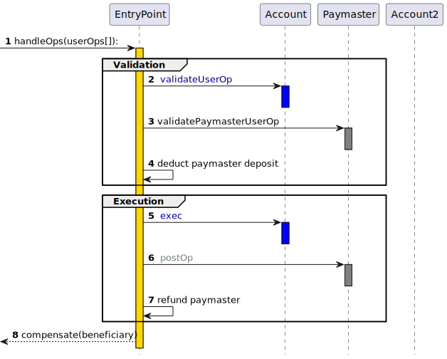

# zkSync Era Account Abstraction

## EIP-4337

### EOA vs CA

以太坊原生的两类账户：

- EOA (Externally Owned Account 外部账户): 由任何拥有私钥的人控制
- CA (Contract Account 合约账户): 部署到网络上的智能合约，由代码控制

EOA 与 CA 最大的区别在于，EOA 可以作为交易发起者，而 Contract 都只能是交易的中继者，即只能被动的触发交易。当一个 Contract Account 想要给另一个地址转账，就必须由一个 EOA 账户作为交易发起者，触发 Contract 的相关函数完成交易。

对于普通用户而言 EOA 账户最大的问题在于密钥的丢失意味着失去了一切账户资产和控制权，另外EOA的验证只能使用 ESDSA 签名算法，以及只能使用 ETH 作为gas等缺点。让 CA 账户来改进这些问题，便是账户抽象的设计初衷。

### EIP-4337 overview

[EIP-4337](https://eips.ethereum.org/EIPS/eip-4337) 是 Vitalik 提出的账户抽象实现标准，也是目前大部分账户抽象实现的模式。该提案旨在不对现有共识层修改的条件下，在更高层级实现账户抽象，具备以下优势：

- 多重签名和社交恢复
- 更高效、更简单的签名算法（例如 Schnorr、BLS）
- 可以使用抗量子安全签名算法（例如 Lamport、Winternitz）
- 可升级性

> 在 EIP-4337 之前， EIP-2938 曾试图解决类似的问题，但因为引入了对以太坊共识层的修改，所以未被广泛采纳。

#### How EIP-4337 works

其工作原理类似于交易内存池 (Mempool)，用户发送将 `UserOperation` 用户意图与签名和其他数据打包在一起的对象以进行验证。使用 Bundler 提供的服务可以将一组`UserOperation` 对象打包成单个“bundle transaction (捆绑交易)”，然后将其包含到以太坊区块中。

Bundler 以 ETH 支付捆绑交易的 gas 费用，并通过作为所有单独UserOperation执行的一部分支付的费用获得补偿。捆绑者将UserOperation根据与矿工在现有交易内存池中操作方式类似的费用优先级逻辑来选择要包含的对象。 `UserOperation` 看起来像是一笔交易，包含:

- `sender`：发起该操作的的账户地址
- `nonce and signature`：传递到AA钱包验证函数的参数，以便AA钱包可以验证操作
- `initCode`：如果AA钱包尚不存在，则用于创建钱包的初始化代码
- `callData`：在实际执行步骤中调用钱包的数据

AA钱包是一个智能合约，需要具备两个主要功能：

- `validateUserOp`，它接受 `UserOperation` 作为输入。该函数的作用是验证 `UserOperation` 的 `nonce` 和 `signature`，如果验证成功则支付费用并增加 `nonce` ，如果验证失败则抛出异常。
- `execution function`，解析 calldata 作为AA钱包的操作指令，并执行。

为了简化AA钱包的逻辑，确保安全等的许多复杂的智能合约逻辑不会包含其中，而是在称为 `EntryPoint` 的全局合约中。

而在AA钱包中，将通过 `require(msg.sender == ENTRY_POINT)` 的简单检查来保证安全性，因此只有受信任的 `EntryPoint` 才能调用AA钱包执行任何操作或支付费用。`EntryPoint` 只在 `validateUserOp` 验证成功后调用 `UserOperation`，因此这足以保护AA钱包免受攻击。另外如果AA钱包尚不存在，`EntryPoint` 还负责使用提供的 `initCode` 创建AA钱包。

综合以上思路，我们可以得出一个抽象账户实现基本的流程图：

**发起调用阶段**

- 1 `sender` (通常是 Bundler) 打包发送 `userOps` 给 `EntryPoint`

**验证阶段** `EtnryPoint` 会批量验证 Bundle Transaction 内的所有 `UserOps` (多个用户的多笔操作)

- 2 (3,4) 如果属于用户1的AA钱包1不存在，`EtnryPoint` 会调用 `Factory` 创建 AA钱包
- 5 `EtnryPoint` 调用用户1的AA钱包1 `validateUserOp` 函数验证该操作是否合法
- 6 AA钱包1在 `EtnryPoint` 中存入ETH以支付接下来的操作产生的gas
- 7 `EtnryPoint` 扣除AA钱包1的 gas 费用
- 8 `EtnryPoint` 调用用户2 的AA钱包2 `validateUserOp` 函数验证该操作是否合法
- 9 AA钱包2在 `EtnryPoint` 中存入ETH以支付接下来的操作产生的gas
- 10 `EtnryPoint` 扣除AA钱包2的 gas 费用

**执行阶段**

- 11 调用AA钱包1的 exec 函数执行用户1的操作
- 12 为AA钱包1执行refund（退回多余的gas费用）
- 13 调用AA钱包2的 exec 函数执行用户1的操作
- 14 为AA钱包2执行refund（退回多余的gas费用）

**完成阶段**

- 15 完成所有调用，补偿受益人（可能是Bundler的维护者）

#### Paymaster(EIP-4337)

在上述流程中，用户仍然必须拥有足够的ETH来支付费用，而很多场景下，用户往往希望用其他方式支付费用，于是便有了 Paymaster 这个角色，可以代替用户使用ETH支付gas费用。我们需要 Paymaster 具备两个主要功能：

- 允许第三方代表用户支付费用
- 允许用户以 ERC20 token (非ETH资产)支付费用，以合约作为媒介收取 ERC20 并以 ETH 支付

Paymaster 需要验证两个条件：

- 验证 sponsor 的签名，如果验证通过 Paymaster 将接受 UserOps 并为此支付费用。
- 验证 `sender` 钱包是否有足够的 ERC20 余额可用于支付 gas 费用。

那么包含 Paymster 的完整流程如下：

1. 发送 `UserOps` 到 `EntryPoint`
2. `EntryPoint` 调用 AA钱包的 `validateUserOp` 验证操作是否合法
3. `EntryPoint` 调用 Paymaster 的 `validatePaymasterUserOp` 验证 Paymaster 是否愿意为该操作支付费用
4. `EntryPoint` 扣除 Paymaster 的存款作为 gas 费用
5. `EntryPoint` 调用 AA钱包的 `exec` 执行操作
6. `EntryPoint` 调用 Paymaster 的 `postOp` 函数（该函数由 Paymaster自定义，通常用户更新状态，广播 event 等等）
7. refund paymster 退还 Paymaster 多余的费用

## AA Mechanism in zkSync Era

zkSync Era 上的账户抽象协议 (以下简称 Native AA) 与 EIP-4337 非常相似，但将一部分功能集成到系统中，优化用户体验和效率。

Native AA 中的组成:

- `bootloader`: System Contract(系统合约)，主要功能是处理用户的操作交易(userOps)，对应 EIP-4337 中的 `EntryPoint` 合约。`bootloader` 只能被系统调用，无法被外部使用者调用。
- `NonceHolder`: System Contract(系统合约)，该合约存储账户nonce值，以及修改nonce (通常调用 `incrementMinNonceIfEquals` 函数)。
- `AAccount`: 继承 `IAcount` 接口的 AA钱包合约，可以自定义实现，但必须实现规定的接口:
  - `validateTransaction` 必须实现
  - `executeTransaction` 必须实现
  - `payForTransaction` 和 `prepareForPaymaster` 必须至少实现 1 个
  - `executeTransactionFromOutside` 非必须，但强烈建议实现
- Paymaster: 继承 `IPaymaster` 接口的合约，可以自定义实现，但必须实现规定的接口:
  - `validateAndPayForPaymasterTransaction` 必须实现，用以确认 paymaster 是否原因承担该交易的费用
  - `postTransaction` 可选实现，在操作交易完成后 `bootloader` 会调用此方法
- `AAFactory`: 可选实现，用于创建 AA钱包 的工厂合约

### Native AA transaction flow

**初始化AA钱包**

1. 调用 `AAFactory.deployAccount()` 函数，触发AA钱包的初始化(部署合约)
2. `AAFactory` 调用系统合约 `ContractDeployer` 的 `create2Account` 函数部署新的 `AAccount` 合约
3. 系统合约 `ContractDeployer` 创建 `AAccount` 合约
4. 系统合约 `ContractDeployer` 将新合约地址返回给 `AAFactory`

**验证阶段**

用户向网络中广播 Native AA 操作请求(没有支付gas)，zksync Era 系统会自动触发 `AAccount` 的相关方法

1. `AAccount` 调用系统合约 `NonceHolder` 中的方法检查 AAccount 的 nonce，并更新（ 通常调用 `incrementMinNonceIfEquals` 函数）
2. `AAccount.validateTransaction` 验证操作的合法性
3. 系统合约 `BootLoader` 将新的nonce标记为已使用；`AAccount` 检查余额是否足够支付gas，用户签名是否正确
4. 支付 gas 费用，将有两种方式：
  a. `AAccount` 直接支付 gas 费用，`BootLoader` 调用 `AAccount.payForTransaction` 函数
  b. 委托 `Paymaster` 代为支付 gas 费用
    - `BootLoader` 调用 `AAccount.prepareForPaymaster` 函数(如果涉及 ERC20 支付费用，这里会调用 `ERC20.approve` 授权给 paymaster 转走token);
    - `BootLoader` 调用 `Paymaster.validateAndPayForPaymasterTransaction` 函数，这里将实现验证交易和向 `BootLoader` 支付gas费用的逻辑，例如 `transferFrom` ERC20 token，并向 `BootLoader` 转账 ETH
5. `BootLoader` 检查收到的 ETH 数额是否足以支付gas费用
6. `BootLoader` 调用 `AAccount.executeTransaction` 执行操作
7. 如果使用了 Paymaster 支付费用，操作执行成功后 `BootLoader` 调用 `Paymaster.postTransaction` 函数

### Native AA vs EIP-4337

### Fee Model and Paymaster

## Reference

- zkSync Era Doc <https://docs.zksync.io/build/developer-reference/account-abstraction.html>
- ERC-4337 <https://eips.ethereum.org/EIPS/eip-4337>
- ERC 4337: account abstraction without Ethereum protocol changes <https://medium.com/infinitism/erc-4337-account-abstraction-without-ethereum-protocol-changes-d75c9d94dc4a>
- Account Abstraction 介紹（一）：以太坊的帳戶現況 <https://medium.com/imtoken/account-abstraction-%E4%BB%8B%E7%B4%B9-%E4%B8%80-%E4%BB%A5%E5%A4%AA%E5%9D%8A%E7%9A%84%E5%B8%B3%E6%88%B6%E7%8F%BE%E6%B3%81-6c03c303f229>
- Account Abstraction 介紹（二）：以太坊未來的帳戶體驗 <https://medium.com/imtoken/account-abstraction-%E4%BB%8B%E7%B4%B9-%E4%BA%8C-%E4%BB%A5%E5%A4%AA%E5%9D%8A%E6%9C%AA%E4%BE%86%E7%9A%84%E5%B8%B3%E6%88%B6%E9%AB%94%E9%A9%97-cca0380d3ba5>
- DL 分享视频 AA workshop <https://space.bilibili.com/2145417872/channel/collectiondetail?sid=1974263>
