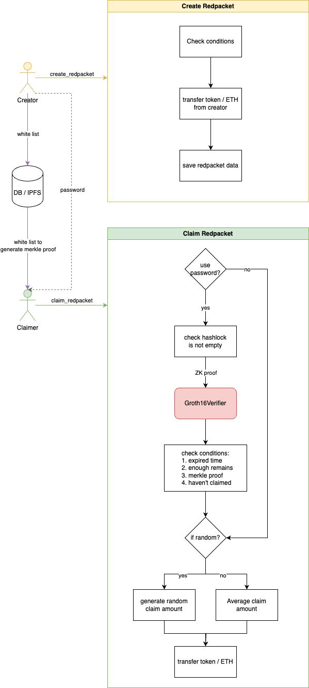
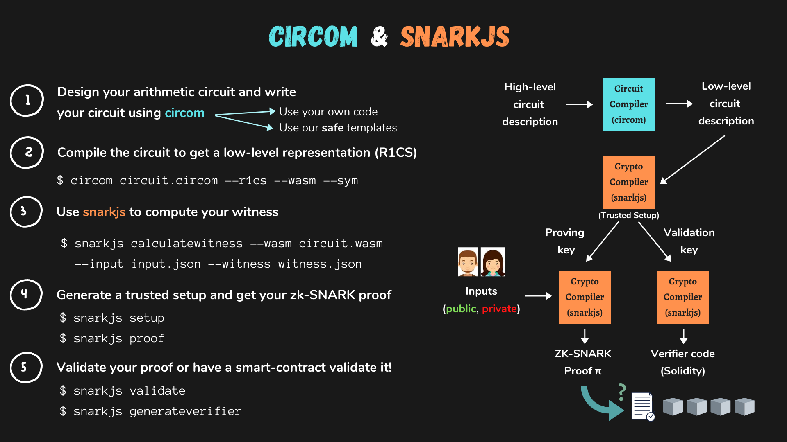

# Develop a ZK redpacket on ZKsync Era

我们将在 ZKsync Era 网络上部署一个 ZK 红包项目，它将满足以下需求：

- 去中心化的红包创建以及领取体验
- 创建者可以设置白名单，名单之外的地址无法领取奖励，有效避免机器人抢红包等恶意行为
- 支持随机金额
- 使用 ZK snark 技术，支持密码红包功能（在不暴露密码明文的基础上，在链上验证密码是否正确）

> ZK 红包项目已经在 DappLearning 官网上线，您可以在 [dapplearning.org/reward](https://dapplearning.org/reward) 体验完整的红包！

## 合约设计

### 需求拆解

接下来我们考虑如何设计红包合约，以满足上述需求。

- 红包创建者可以设置白名单。显然将白名单完整的保存于链上是不现实的，这将会带来大量的gas消耗，一种通用的方案就是使用 [Merkle Tree](https://en.wikipedia.org/wiki/Merkle_tree)。
  - 链上只需要保存 Merkle Root，用户领取红包时，需要根据完整的白名单地址列表，生成 Merkle Proof
  - 由于生成proof需要完整的地址列表，所以我们需要额外的为用户保存这些列表，例如结合后端数据库，或者使用 IPFS 去中心化存储
- 支持随机金额。实际上是需要链上生成随机数来随机划分金额。
  - 可以简单的使用 `block.timestamp`, `msg.sender`, `nonce`, 随机种子等字段进行打包hash，然后转换为数字
  - 或者使用 Chainlink 的链上随机数服务（有一定使用成本）
- 支持红包密码功能。如果我们希望实现类似口令红包的功能，用户只有在输入正确密码的情况下才能领取，那么在智能合约中实现最大的难点在于如何隐藏明文密码。
  - 使用 ZK snark 技术，设计一个简单的电路，即将明文密码进行一次hash运算，用户在领取时，提供这个hash运算过程的 ZK proof证明
  - 由于明文密码已经经过hash运算，公开的 zk 电路输出只是一个hash值，不会暴露明文密码
  - 而 ZK snark 技术保证了用户进行hash的原象是正确的密码

### 流程梳理



我们继续梳理整个流程：

1. 初始化红包合约
  a. 设置随机种子，用于随机红包的随机数生成
  b. 设置 ZK snark 的 verifier 合约地址（稍后会解释用途）
2. 创建红包的准备阶段
  a. 在调用合约创建接口之前，创建者还需要在链下进行一些计算：
    - 根据白名单地址列表生成 merkle tree，拿到 merkle root
    - 如果将创建密码红包，需要计算密码的hash值，**注意：这里必须使用和 zk 电路一致的hash方法，且需要 `zk-friendly`, 比如 `Poseidon Hash`**
    - 如果不设置密码，`lock` 字段直接传零值
  b. 保存白名单列表，一种方法是传给后端数据库，一种方法是保存在去中心化存储中，例如 IPFS
  c. 如果红包奖励的是ERC20 token，需要先进行 approve 授权操作
3. 创建红包
  a. 调用红包创建接口，传入相关参数
  b. 红包合约的 nonce + 1
  c. 根据 `msg.sender` + `message` (自定义消息，一般为时间戳) 进行hash，作为新红包的id
  d. 合约进行条件检查
    - 可领取人数检查，至少大于 0，且不能超过上限
    - token_type 检查，0 为 ETH，1 为 ERC20 token，不允许其他值
    - 保证每个领取者领取的金额有一个下限（比如0.1），避免因随机生产的过于极端的金额，即 `总金额 / 数量 >= 0.1`
    - 检查新红包id没有重复
  e. 转入 ETH 或者 ERC20 token ，检查合约余额变化，转账金额是否足够
  f. 发送 event，便于链下跟踪相关数据
4. 领取红包准备阶段
  a. 是否为密码红包
    - 是，需要额外生成 ZK proof
    - 否，跳过
  b. 获取完整的白名单地址列表，生成自己的 merkle proof
5. 领取红包, 这里区分为两个接口，一个普通红包领取，不需要传入 zk proof，另一个密码红包领取，需要 zk proof
  a. 是否为密码红包
    - 是，调用 `claimPasswordRedpacket`, 大部分流程与普通红包一样，但是会先调用 zk 相关的验证方法 `Groth16Verifier.verifyProof()`
    - 否，调用 `claimOrdinaryRedpacket`
  b. 条件检查
    - 红包是否已过期，过期无法领取
    - 已领取的人数小于总可领取人数，即可领取人数满后，不能领取
    - 验证 merkle proof，即领取者是否在白名单列表中
    - 领取者尚未领取该红包
  c. 是否为随机金额红包
    - 是，计算随机数，进而得到随机金额，且不低于领取下限
    - 否，直接均分金额
  d. 存储领取者的地址以及金额
  e. 转账
  f. 发送 event，便于链下跟踪相关数据
6. 过期红包的金额赎回
  a. 条件检查
    - 是否为创建者
    - 该红包是否已经过期
    - 红包仍有金额（没有领取完）
  b. 转账
  c. 发送 event，便于链下跟踪相关数据

## how to use circom and snark.js

由于 zk-SNARK 原理非常复杂且难懂，很难快速向您解释其底层原理，这里将简单介绍两种工具的使用流程，以及每一条命令后做了什么事情。掌握这些步骤即可搭建简单的 zk 应用，当然还是强烈建议您深入了解其原理，领略 ZK 的魅力，推荐 ret 老师在我们开源大学分享的 [zk-SNARK 系列课程](https://www.youtube.com/watch?v=9Wn5MC3hslQ)。

- `circom` 用于编写电路的文件格式，同时 circom 可执行文件提供了将电路文件编译为 二进制 `wasm` 文件的方法，即从高级语言编译到低级语言
- `snarkjs` 遵循 zk-SNARK 协议，根据电路生成证明以及验证的工具库



上图所描述的过程：

1. 编写电路（使用 `.circom` 文件）
2. 将电路编译成二进制文件 `.wasm`
3. 生成 witness 文件
  a. witness 可以近似的理解为结合 input 输入 和 算数电路约束的一种数据形式
  b. 在 zk 红包的开发中，我们不会使用 witness 文件，而是借助 `verification_key`, `.zkey` 文件，直接使用js脚本生成 proof
4. 进行 trust setup（信任仪式）生成 `.ptau` 文件，进而生成 `.zkey` 文件；然后根据 `.zkey` 以及 `.wasm` 文件，以及 input 输入 生成 proof；
  a. `.ptau` 文件不要暴露，建议在完成trust setup 步骤后删除，如果暴露，则会面临被攻击的风险
  b. `.zkey` 文件包含电路的证明密钥（proving key）和验证密钥（verification key）
5. 验证 zk proof (该图版本较老，命令有所差异)

### 红包电路设计

我们的目的是让用户在不暴露密码的情况，证明密码正确。通常电路的 input 可以是 `private`,  output 是 public。所以我们的电路的 output 不能输出明文密码，那么一个单向的hash函数可以很好的满足这个需求。

也就是说，我们需要设计一个电路，约束一个hash运算，prover 可以隐藏自己的明文密码输入，但是输出是密码的hash，这个hash可以公开，保存在链上，以便验证者核对检查。

`password(private) -> hash function(circuit) -> hash(public)`

由于 hash 函数的单向性质，攻击者很难从hash还原到原象（明文密码）；同时我们使用电路约束了hash计算过程的正确性，那么当prover提供了一个的proof，证明了计算过程合法，且输出的hash与链上保存一致，我们就能认为prover是知道正确密码的。

### verifier 合约

上述图片过程是使用命令行进行生成 proof 以及验证的过程，而我们开发的红包应用则需要将验证阶段放到链上，snarkjs 提供了一个非常好用的命令，帮助我们自动生成 `verifier.sol` 合约。

```sh
npx snarkjs zkey export solidityverifier circuit_final.zkey contracts/redpacket/verifier.sol
```

得到合约文件后，我们只需要将其部署到链上，调用其验证接口，就能实现链上 zk proof 验证。

另外我们还需要将 verfication_key 导出为 json 文件，方便脚本调用

```sh
# Export the verification key
npx snarkjs zkey export verificationkey circuit_final.zkey verification_key.json
```

verifier 合约是一个非常复杂的合约，充斥着大量的"魔法数字"以及难以理解的 `assembly` 代码, 简单来说它的功能是使用 `verification_key` 来验证 zk proof。对比这些数字，不难发现合约中的 verfication key 和我们导出的 json 文件是一致的。

```solidity
// verifier.sol
contract Groth16Verifier {
    ...
    // Verification Key data
    uint256 constant alphax  = 19697311613983860786212999493703568908688055110191172310826512624877065310240;
    uint256 constant alphay  = 15269637490765963877960429824285449706379884451647116762156513512057908209004;
    uint256 constant betax1  = 20296311323050859114464236566100939242060256604420178663056396770577093522106;
    uint256 constant betax2  = 13493524922581187257154998994913263575067438443058928748339785154227743480315;

    function verifyProof(uint[2] calldata _pA, uint[2][2] calldata _pB, uint[2] calldata _pC, uint[1] calldata _pubSignals) public view returns (bool) {
      ...
    }
}
```

```json
// verification_key.json
{
 ...
 "vk_alpha_1": [
  "19697311613983860786212999493703568908688055110191172310826512624877065310240",
  "15269637490765963877960429824285449706379884451647116762156513512057908209004",
  "1"
 ],
 "vk_beta_2": [
  [
   "13493524922581187257154998994913263575067438443058928748339785154227743480315",
   "20296311323050859114464236566100939242060256604420178663056396770577093522106"
  ],
  [
   "20523082812265072401230822370196284808250923800479258640050610593596972848609",
   "14567830741370033739684300122126422233548108646784945873266980459071562511739"
  ],
  ...
}
```

在js脚本生成 proof 的过程中，我们可以直接使用 `groth16.fullProve` 函数来生成 proof，不用运行命令行命令。

```ts
import { groth16 } from "snarkjs";
...
export const calcProof = async (input: string) => {
  const proveRes = await groth16.fullProve(
    { in: keccak256(toHex(input)) },
    path.join(__dirname, "../datahash_js/datahash.wasm"),
    path.join(__dirname, "../circuit_final.zkey")
  );
  ...
}
```

## 核心代码实现

### circom circuit

为了实现 zk 验证密码，我们需要编写一个简单的 circom 电路。

> circom的基本语法比较简单，可以参考 [circom 官方文档](https://docs.circom.io/getting-started)

这个电路约束了一个简单的 Poseidon hash 的运算过程，prover 将通过这个电路，证明他的 hash 结果是按照规则计算得出，而计算结果将与链上保存的 hash lock 值比较，如果一致，说明 prover 输入了正确的密码。

```circom
pragma circom 2.0.0;

include "../node_modules/circomlib/circuits/poseidon.circom";

template PoseidonHasher() {
    signal input in;
    signal output out;

    component poseidon = Poseidon(1);
    poseidon.inputs[0] <== in;
    out <== poseidon.out;
}

component main = PoseidonHasher();
```

### 合约

#### RedPacket struct

存储 Redpacket 数据的结构体，以及 `redpacket_by_id` mapping.

字段说明：

- `packed` 合并存储一些长度较短的数据，节省gas
  - `total_tokens` 总金额
  - `expire_time` 红包过期的时间戳
  - `token_addr` ERC20 token 的地址, ETH 则可以输入零地址
  - `claimed_numbers` 已经领取的人数
  - `token_type` 0 为 ETH 红包，1 为 ERC20 token 红包
  - `ifrandom` true 为随机金额， false 为平均分配金额

```solidity
struct RedPacket {
    Packed packed;
    mapping(address => uint256) claimed_list;
    bytes32 merkleroot;
    bytes32 lock;
    address creator;
}
struct Packed {
    uint256 packed1; // 0 (128) total_tokens (96) expire_time(32)
    uint256 packed2; // 0 (64) token_addr (160) claimed_numbers(15)  token_type(1) ifrandom(1)
}

mapping(bytes32 => RedPacket) public redpacket_by_id;
```

#### create_red_packet

```solidity
function create_red_packet(
    bytes32 _merkleroot,
    bytes32 _lock,
    uint _number,
    bool _ifrandom,
    uint _duration,
    string memory _message,
    string memory _name,
    uint _token_type,
    address _token_addr,
    uint _total_tokens
) public payable {
    nonce++;

    // check conditions...

    // ETH / token transferFrom creator
    if (_token_type == 0) {
            require(
                msg.value > 10 ** 15 * _number,
                "At least 0.001 ETH for each user"
            );
            require(msg.value >= _total_tokens, "No enough ETH");
    } else if (_token_type == 1) {
        
        IERC20(_token_addr).safeTransferFrom(
            msg.sender,
            address(this),
            _total_tokens
        );
        
        received_amount = balance_after_transfer - balance_before_transfer;
        require(received_amount >= _total_tokens, "#received > #packets");
    }

    bytes32 _id = keccak256(abi.encodePacked(msg.sender, _message));

    // save data to redpacket_by_id[_id]
}
```

#### claim

claim 根据红包是否设置密码，分为两个接口，主要区别在于有密码需要额外传入 ZK proof，即三个二维数组 `pa`, `pb`, `pc`, 且需要调用外部合约 Verifier 的验证方法，进行ZK验证。

```solidity
function claimOrdinaryRedpacket(
    bytes32 _id,
    bytes32[] memory proof
) public returns (uint claimed) {
    //check exist or not
    RedPacket storage rp = redpacket_by_id[_id];
    require(rp.lock == bytes32(0), "Not ordinary redpacket");

    claimed = _claim(_id, proof);
}

function claimPasswordRedpacket(
    bytes32 _id,
    bytes32[] memory proof,
    uint[2] calldata _pA,
    uint[2][2] calldata _pB,
    uint[2] calldata _pC
) public returns (uint claimed) {
    RedPacket storage rp = redpacket_by_id[_id];
    require(rp.lock != bytes32(0), "Not password redpacket");
    uint256[1] memory input;
    input[0] = uint256(rp.lock);

    require(
        verifier.verifyProof(_pA, _pB, _pC, input),
        "ZK Verification failed, wrong password"
    );

    claimed = _claim(_id, proof);
}
```

claim 内部函数的核心逻辑代码实现:

1. 检查红包是否过期
2. 检查 Merkle proof
3. 根据是否为随机红包，来计算领取金额
  a. 是
    - 如果仅剩一个未领取的红包，则直接将所剩余额都给予最后一位领取者
    - 计算随机金额，需要扣除剩余的最低金额，再进行随机
  b. 否
    - 如果仅剩一个未领取的红包，则直接将所剩余额都给予最后一位领取者
    - 均分金额
4. 检查用户是否已经领取过该红包
5. 转账
6. 发送 event

```solidity
function _claim(
    bytes32 _id,
    bytes32[] memory proof
) internal returns (uint claimed) {
    ...
    // check expired
    require(unbox(packed.packed1, 224, 32) > block.timestamp, "Expired");
    ...

    // check merkle proof
    require(
        MerkleProof.verify(proof, rp.merkleroot, _leaf(msg.sender)),
        "Verification failed, forbidden"
    );

    ...
    if (ifrandom == 1) {
        if (total_number - claimed_number == 1)
            claimed_tokens = remaining_tokens;
        else {
            // reserve minium amount => (total_number - claimed_number) * 0.1
            uint reserve_amount = (total_number - claimed_number) *
                minium_value;
            uint distribute_tokens = remaining_tokens - reserve_amount;
            claimed_tokens =
                random(seed, nonce) %
                ((distribute_tokens * 2) / (total_number - claimed_number));

            // minium claimed_tokens for user is 0.1 ; and round the claimed_tokens to decimal 0.1
            claimed_tokens = claimed_tokens < minium_value
                ? minium_value
                : (claimed_tokens - (claimed_tokens % minium_value));
        }
    } else {
        if (total_number - claimed_number == 1)
            claimed_tokens = remaining_tokens;
        else
            claimed_tokens =
                remaining_tokens /
                (total_number - claimed_number);
    }

    // Penalize greedy attackers by placing duplication check at the very last
    require(rp.claimed_list[msg.sender] == 0, "Already claimed");

    // save data to redpacket_by_id[id]

    // send event
    
}
```

#### refund

如果红包已经过期，且金额还没领取完，创建者可以调用 `refund` 赎回未领取的金额。

1. 检查是否为红包创建者
2. 检查是否已过期
3. 将剩余的 ETH / ERC20 转给创建者
4. 发送 event

```solidity
function refund(bytes32 id) public {
    ...
    require(creator == msg.sender, "Creator Only");
    require(
        unbox(packed.packed1, 224, 32) <= block.timestamp,
        "Not expired yet"
    );
    ...

    if (token_type == 0) {
        (bool success, ) = payable(msg.sender).call{
            value: remaining_tokens
        }("");
        require(success, "Refund failed.");
    } else if (token_type == 1) {
        transfer_token(token_address, msg.sender, remaining_tokens);
    }

    emit RefundSuccess(id, token_address, remaining_tokens, rp.lock);
}
```

### 部署与交互脚本

#### 部署

1. 部署红包合约
2. 部署 Groth16Verifier 合约（该合约通过 snarkjs 结合电路文件生成，详细过程会在下面讲解）
3. 红包合约初始化，将 Groth16Verifier 合约地址传入
4. 保存合约地址到 json 文件

```ts
import { deployContract, saveDeployment } from "./utils";

export default async function () {
  const redPacket = await deployContract("HappyRedPacket");
  const redPacketAddress = await redPacket.getAddress();

  const groth16Verifier = await deployContract("Groth16Verifier");
  const groth16VerifierAddress = await groth16Verifier.getAddress();

  console.log("Groth16Verifier address:", groth16VerifierAddress);

  let initRecipt = await redPacket.initialize(groth16VerifierAddress);

  await initRecipt.wait();

  saveDeployment({
    Redpacket: redPacketAddress,
    Verifier: groth16VerifierAddress,
  });
}
```

#### 交互脚本

1. 读取红包合约部署地址，初始化红包合约实例
2. 初始化测试 token 实例
3. approve 授权操作
4. 根据白名单生成 Merkle Tree， 这里使用 `merkletreejs` 依赖.
  a. 需要将 address 先进行 hash 再作为 Merkle Tree 的叶子节点
5. hashlock 字段
  a. 如果没有设置密码，直接传 `BYTES_ZERO`
  b. 如果有设置密码，需要使用 `Poseidon Hash` 对明文密码进行hash，作为 hash lock 值
6. 创建红包
7. 领取红包

```ts
import MerkleTree from "merkletreejs";
...

export default async function () {
  ...
  // Initialize contract instance for interaction
  const redPacket = new ethers.Contract(
    CONTRACT_ADDRESS,
    CONTRACT_ABI,
    wallet, // Interact with the contract on behalf of this wallet
  );
  const redPacketAddress = await redPacket.getAddress();

  const testToken = new ethers.Contract(
    ERC20_ADDRESS,
    (await hre.artifacts.readArtifact("SimpleToken")).abi,
    wallet,
  );
  const testTokenAddress = await testToken.getAddress();

  // approve...

  // white list
  const claimerList = [
    wallet.address,
    "some other address",
  ];
  // generate merkle tree
  const merkleTree = new MerkleTree(
    claimerList.map((user) => hashToken(user as `0x${string}`)),
    keccak256,
    { sortPairs: true },
  );
  const merkleTreeRoot = merkleTree.getHexRoot();
  console.log("merkleTree Root:", merkleTreeRoot);

  let message = new Date().getTime().toString();

  let lock = ZERO_BYTES32;
  if (password) {
    lock = await calculatePublicSignals(password);
  }

  let redpacketID = "";

  await createRedpacket();
  await cliamRedPacket(wallet);
}
```

创建红包, 发出创建红包的交易后，会监听交易回执，解析其中的event参数，将红包 id 打印出来

```ts
async function createRedpacket() {
  // create_red_packet
  let creationParams = {
    _merkleroot: merkleTreeRoot,
    _lock: lock,
    _number: claimerList.length,
    _ifrandom: true,
    _duration: 259200,
    _message: message,
    _name: "cache",
    _token_type: 1,
    _token_addr: testTokenAddress,
    _total_tokens: parseEther("1"),
  };

  let createRedPacketTx = await redPacket.create_red_packet(
    ...Object.values(creationParams),
  );
  const createRedPacketRes = await createRedPacketTx.wait();
  const creationEvent = createRedPacketRes.logs.find(
    (_log: EventLog) =>
      typeof _log.fragment !== "undefined" &&
      _log.fragment.name === "CreationSuccess",
  );
  if (creationEvent) {
    const [
      total,
      id,
      ...
    ] = creationEvent.args;
    redpacketID = id;

    console.log(
      `CreationSuccess Event, total: ${total.toString()}\tRedpacketId: ${id}  `,
    );
    console.log(`lock: ${hash_lock}`);
  } else {
    throw "Can't parse CreationSuccess Event";
  }

  console.log("Create Red Packet successfully");
}
```

领取红包，根据是否有密码，调用不同的接口

- 有密码，先生成 zk proof，再调用 `claimPasswordRedpacket`
- 没有密码，调用 `claimOrdinaryRedpacket`

```ts
// claim
async function cliamRedPacket(user) {
  let merkleProof = merkleTree.getHexProof(hashToken(user.address));
  const balanceBefore = await testToken.balanceOf(user.address);

  let claimTx: any;
  if (password) {
    const proofRes = await calcProof(password);
    if (proofRes) {
      const {
        proof: { a, b, c },
        publicSignals,
      } = proofRes;
      claimTx = await redPacket
        .claimPasswordRedpacket(redpacketID, merkleProof, a, b, c)
        .catch((err) => console.error(err));
    }
  } else {
    claimTx = await redPacket.claimOrdinaryRedpacket(
      redpacketID,
      merkleProof,
    );
  }

  const createRedPacketRecipt = await claimTx.wait();
  console.log("createRedPacketRecipt", createRedPacketRecipt);

  const balanceAfter = await testToken.balanceOf(user.address);
  console.log(
    `user ${user.address} has claimd ${balanceAfter - balanceBefore}`,
  );
}
```

`calculatePublicSignals` 对明文密码进行 poseidon hash，这里使用 `circomlibjs` 依赖

```ts
import { buildPoseidon } from "circomlibjs";

export const calculatePublicSignals = async (input: string) => {
  const poseidon = await buildPoseidon();
  const hash = poseidon.F.toString(poseidon([keccak256(toHex(input))]));
  return toHex(BigInt(hash), { size: 32 });
};
```

`calcProof` 计算 zk proof

- 将密码作为电路的输入 `in` 字段，依赖 wasm 和 zkey 文件生成 proof
- 验证生成的proof是否能通过

```ts
import { encodePacked, keccak256, parseEther, toHex } from "viem";
import { groth16 } from "snarkjs";
...

export const calcProof = async (input: string) => {
  const proveRes = await groth16.fullProve(
    { in: keccak256(toHex(input)) },
    path.join(__dirname, "../datahash_js/datahash.wasm"),
    path.join(__dirname, "../circuit_final.zkey")
  );

  const res = await groth16.verify(
    Vkey,
    proveRes.publicSignals,
    proveRes.proof
  );

  if (res) {
    const proof = convertCallData(
      await groth16.exportSolidityCallData(
        proveRes.proof,
        proveRes.publicSignals
      )
    );

    return {
      proof: proof,
      publicSignals: proveRes.publicSignals,
    };
  } else {
    console.error("calculateProof verify faild.");
    return null;
  }
};
```


## 测试,部署,交互

### 安装依赖

```sh
# snarkjs
npm install -g snarkjs@latest

# circom
# 参考 circom 官网
# https://docs.circom.io/getting-started/installation

# 项目依赖
yarn install
```

### `snarkjs trust setup` 阶段

- 生成 ptau 文件。**注意：ptau 文件不要公开，如果泄露 ZK 电路会有被攻击的风险，可以在完成 setup 阶段后删除 ptau 文件**.

```sh
# Start a new powers of tau ceremony
npx snarkjs powersoftau new bn128 14 pot14_0001.ptau -v

# Contribute to the ceremony
npx snarkjs powersoftau contribute pot14_0001.ptau pot14_0002.ptau --name="Second contribution" -v -e="some random text"

# Apply a random beacon
# 数字是 32 bytes 的随机数字
npx snarkjs powersoftau beacon pot14_0002.ptau pot14_beacon.ptau 0102030405060708090a0b0c0d0e0f101112131415161718191a1b1c1d1e1f 10 -n="Final Beacon"

# Prepare phase 2
# 这一步耗时较长
npx snarkjs powersoftau prepare phase2 pot14_beacon.ptau pot14_final.ptau -v

# 生成最终的 ptau 文件
npx snarkjs powersoftau verify pot14_final.ptau
```

- 编写电路 `circuits/datahash.circom`

```circom
pragma circom 2.0.0;

include "../node_modules/circomlib/circuits/poseidon.circom";

template PoseidonHasher() {
    signal input in;
    signal output out;

    component poseidon = Poseidon(1);
    poseidon.inputs[0] <== in;
    out <== poseidon.out;
}

component main = PoseidonHasher();
```

- 编译电路

  - 这一步会在 `datahash_js` 文件夹下生成三个文件: `datahash.wasm`, `generate_witness.js`, `witness_calculator.js`, 用于后续生成证明
  - 以及 `datahash.r1cs` 和 `dahash.sym` 文件，用于完成 trust setup 的第二阶段

```sh
circom circuits/datahash.circom --r1cs --wasm --sym
```

- trust setup 第二阶段，生成 zkey 文件

```sh
# Groth16 requires a trusted ceremony for each circuit.
npx snarkjs groth16 setup datahash.r1cs pot14_final.ptau circuit_0000.zkey

# Contribute to the phase 2 ceremony
npx snarkjs zkey contribute circuit_0000.zkey circuit_final.zkey --name="1st Contributor Name" -e="some random text" -v

# Verify the latest zkey
npx snarkjs zkey verify datahash.r1cs pot14_final.ptau circuit_final.zkey

# Export the verification key
npx snarkjs zkey export verificationkey circuit_final.zkey verification_key.json
```

- **建议删除所有 .ptau 文件**

### 生成 `verifier.sol`

trust setup 完成后，我们需要利用snarkjs自动生成 `verifier.sol` 文件，辅助红包合约进行链上的zksnark验证。

```sh
npx snarkjs zkey export solidityverifier circuit_final.zkey contracts/redpacket/verifier.sol
```

### 编译合约运行测试

```sh
npx hardhat compile

npx hardhat test --network hardhat
```

### 部署到测试网络

```sh
npx hardhat deploy-zksync --script deploy.ts --network zkSyncSepoliaTestnet

# output
Starting deployment process of "HappyRedPacket"...
Wallet address: 0x67a6Ba1b418911EB67AF4E2DfEF80aCBe2cCE0b6
Estimated deployment cost: 0.0042542753 ETH

"HappyRedPacket" was successfully deployed:
 - Contract address: 0x1FB0E4Bd48a09C3569c570B2Cd70200dd84c096F
 - Contract source: contracts/redpacket/HappyRedPacket.sol:HappyRedPacket
 - Encoded constructor arguments: 0x

Requesting contract verification...
Your verification ID is: 26382
Contract successfully verified on ZKsync block explorer!

Starting deployment process of "Groth16Verifier"...
Wallet address: 0x67a6Ba1b418911EB67AF4E2DfEF80aCBe2cCE0b6
Estimated deployment cost: 0.00083167485 ETH

"Groth16Verifier" was successfully deployed:
 - Contract address: 0x3e6b146aBb56c49D7e87f940112971546e761CeB
 - Contract source: contracts/redpacket/verifier.sol:Groth16Verifier
 - Encoded constructor arguments: 0x

Requesting contract verification...
Your verification ID is: 26383
Contract successfully verified on ZKsync block explorer!
Groth16Verifier address: 0x3e6b146aBb56c49D7e87f940112971546e761CeB
```

### 调用脚本与红包合约交互

交互脚本

```sh
npx hardhat deploy-zksync --script interact.ts --network zkSyncSepoliaTestnet

# output
Running script to interact with contract 0x1FB0E4Bd48a09C3569c570B2Cd70200dd84c096F
Wallet address: 0x67a6Ba1b418911EB67AF4E2DfEF80aCBe2cCE0b6
allowance: 115792089237316195423570985008687907853269984665640564039457.584007913129639935
Redpacket Nonce: 3n
merkleTree Root: 0xa49ea2b86a72603f37d4eee7d52b4b0c85fd23e5605603ad82b7dc10d48fd2c5
CreationSuccess Event, total: 1000000000000000000       RedpacketId: 0x945f7018e48934dc180db1a25b1ef14b2ef2b33eb03f6d5806b7ac084648d8fe  
lock: 0x22abfb84e37f8a8623a6486a1158311ed0a25038730b70d9312df8112c4a7e22
Create Red Packet successfully
createRedPacketRecipt ContractTransactionReceipt {
  provider: Provider { _contractAddresses: {} },
  to: '0x1FB0E4Bd48a09C3569c570B2Cd70200dd84c096F',
  from: '0x67a6Ba1b418911EB67AF4E2DfEF80aCBe2cCE0b6',
  contractAddress: null,
  hash: '0x94a675bda6599a22e93b0125f6149870a63ce5f9be8dcbb909698bfbfc851c38',
  index: 0,
  blockHash: '0xa79b740ebe25d38b8560bf52e7afad5a523b0b41ae40502525155602253c7da8',
  blockNumber: 3819025,
  logsBloom: '0x00000000000400000000004000800000000000000000000040000000000000000000010000000000000000000000000000000000000008000000000000000000000000000000040000000008000000000000200000100000000000000000082000000000000000000000000000000000000000000000002000000010000000000000000000000000000004000000000000000000004000000000000000000010000000000000100000000000000000000000000000000000000000000000000400000002008000000000000000200000000000000000000000000000000000000000000000000000000000000000000040000000001000000000000000000000',
  gasUsed: 8811086n,
  blobGasUsed: undefined,
  cumulativeGasUsed: 0n,
  gasPrice: 25000000n,
  blobGasPrice: undefined,
  type: 113,
  status: 1,
  root: '0xa79b740ebe25d38b8560bf52e7afad5a523b0b41ae40502525155602253c7da8'
}
user 0x67a6Ba1b418911EB67AF4E2DfEF80aCBe2cCE0b6 has claimd 700000000000000000
```

