# Lesson 6: Bridges on ZKsync Era

跨链（Interoperability）技术主要有三种：
公证人机制，哈希时间锁，中继

1. 公证人机制
   公证人机制是技术上可实现的最简单的一种跨链机制，本质上是一种中介的方式。通过引入一个或多个可信第三方做信用背书，持续监听链上的事件，并根据获取到的事件信息负责在其他链上进行跨链消息的验证和转发。公证人机制的实现方式主要分为以下三种：
1. 单签名公证人机制
   最简单的公证人机制，该方式会选取一个独立的节点或者机构作为第三方公证人。公证人在整个跨链交互中进行数据收集、验证、交易确认等任务。该方式兼容性高、交易速度快，但使用范围仅限于跨链资产交换等场景。
   场景：CEX
1. 多签名公证人机制
   该方式中公证人为一群独立节点或者机构组成的联盟，每个节点都拥有一个密钥，只有一定比例的公证人在跨链交易上签名达成共识时，该交易才有效。
   该方式弱化了单签名公证人机制的中心化风险，具有更高的安全性，即使有部分节点受到恶意攻击也不会影响整个跨链系统的运行。
   场景：debridge wormhole
1. 分布式签名公证人机制
   该方式相较于多签名公证人机制，采用了多方计算 MPC（multipartycomputation）来确保密钥的安全性和隐私性。即将密钥拆分为多个碎片并随机分发给公证人，但无法利用这些碎片得出完整的密钥，仅当一定比例的公证人共同完成签名后才能拼凑出完整的密钥。
   场景：multichain synapse
1. HTLC
   哈希锁定
   哈希锁定全称为哈希时间锁定合约（Hash timelock contract），该方式利用哈希函数的单向性与低碰撞性，通过哈希锁和时间锁，在无需可信第三方作为公证人的情况下完成不同链间资产兑换的跨链技术。哈希时间锁要求接收方在规定的 deadline 期限内，能够确认收款并生成证明给发送方，否则资金将会归还。发送方能够使用收款证明获取到接收方在目标链上的资金或触发相关事件。
   该方式的能够保证同一条链上的资产总量保持不变，但通常只能用于转账操作。下面以闪电网络中基于哈希锁定的原子交换实现过程：
   哈希时间锁一个是功能受限，它能做的就是资产的互换
   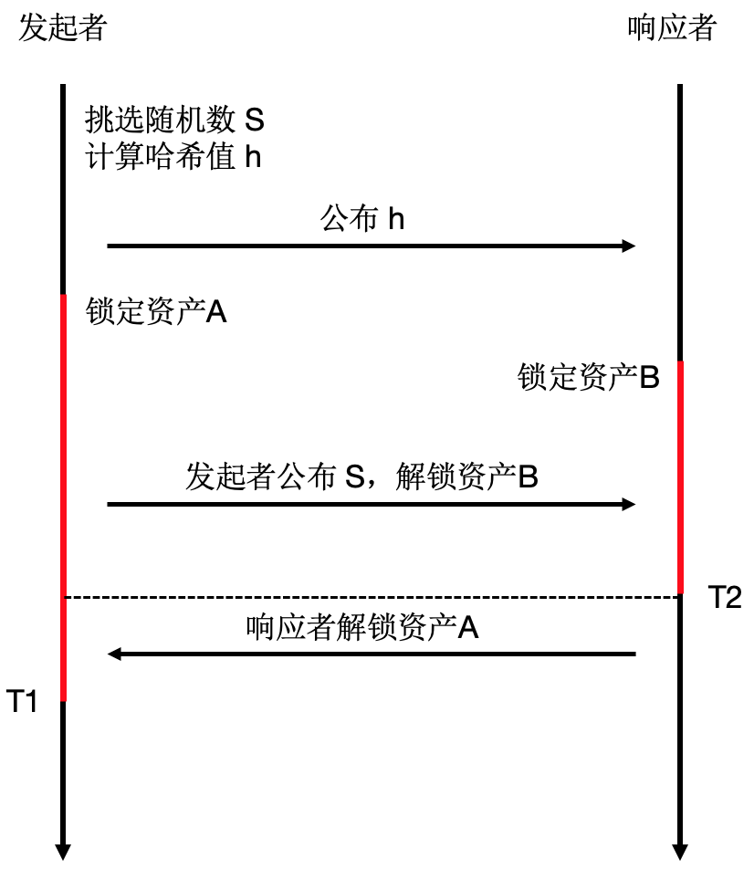

1. 中继
   更为通用的跨链方式。 跨链的实质的就是实现两条链消息的互通，即把 A 链发生的事情告诉 B 链，公证人机制是通过信任一个第三方来实现跨链。
   而中继方案则是不信任第三方。使用中继跨链，验证的不是这条消息来自于哪个中继，验证的是这条消息是不是来自于源链，如果是，就执行该执行的操作。
   见证人可以看做是需要被信任的中继，中继可以看做是无需被信任的见证人。这就是两者的核心区别，中继显然比见证人更符合 trustless 的原则。
   而如何来实现对源链信息的验证。 这里就有多种方案:
   SPV 技术
   SPV（Simple Payment Verification）模式
   当一条消息跨链过来，中继不但要把消息给目标链，还要把消息的证明给目标链，这个证明是一个 Merkle Proof，它告诉我这个事件或这笔交易是发生在你这条链上的哪个区块（高度）。
   拿到 Merkle Proof 后，因为有源链所有的区块头，就可以把对应高度的区块头拿出来，用 Merkle Proof 验证这个交易或者这个事件是否存在。如果存在性得到证明，就确定了这个消息确实是源自于源链。
   这种方案类似于在目标链上实现轻客户端。 在侧链和其他应用场景使用较多。

可为什么大家不去实现完美的中继跨链呢？因为有些链是没有办法实现别的链的轻客户端的。比如比特币，它上面实现不了任何一个链的轻客户端。那就引出下一个中继链技术。

中继链技术
中继链是对跨链操作的一种抽象，跨链流程中的信息验证问题被抽象成中继层的共识问题， 在此抽象层上可以开发出一条独立的区块链，具有了更好的可扩展性。作为跨链交易的账本，在跨链操作中出现了第三条区块链，即中继链。
在此模式中，存在一系列的中继节点被部署在各个区块链网络中， 负责监控、和同步该区块链的交易数据到中继链。中继链的共识节点验证跨链交易的有效性，并触发对应交易的执行。通过在每条链上部署智能合约，作为跨链操作的接口，中继模式还能将跨链作为一项基础设施，服务更多有跨链需求的项目。
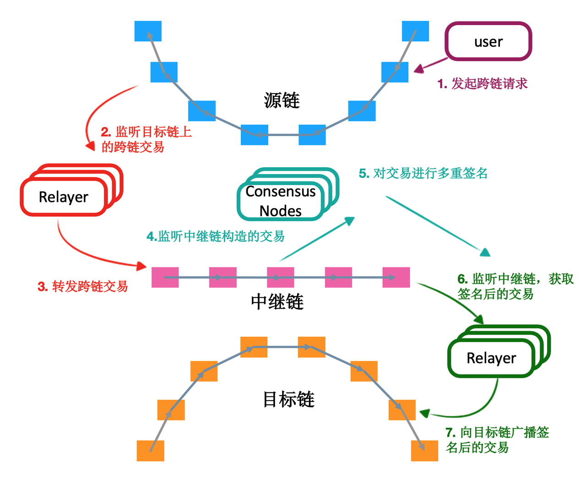
一次典型的中继跨链操作，如上图所示：

1. 用户在源链发起跨链交易请求
2. 中继节点监测并搬运该交易信息至中继链
3. 中继链共识节点验证交易的有效性
4. 验证通过以后，共识节点构造对应交易
5. 多数共识节点对交易进行签名，组成签名集合
6. 中继节点监测共识节点产生的交易及签名
7. 中继节点搬运该交易至目标链，等待执行
   中继链的共识算法决定着跨链服务的性能和安全性，经典的拜占庭容错算法，例如 PBFT，能够在大多数节点正常工作的条件下，实现较高的交易处理速度。改进版的拜占庭容错算法，例如 HotStuff，进一步减少了通信复杂度，支持更大规模的节点参与共识。
   类似于 cosmos 和 polkdot 都是中继链的原理实现。
   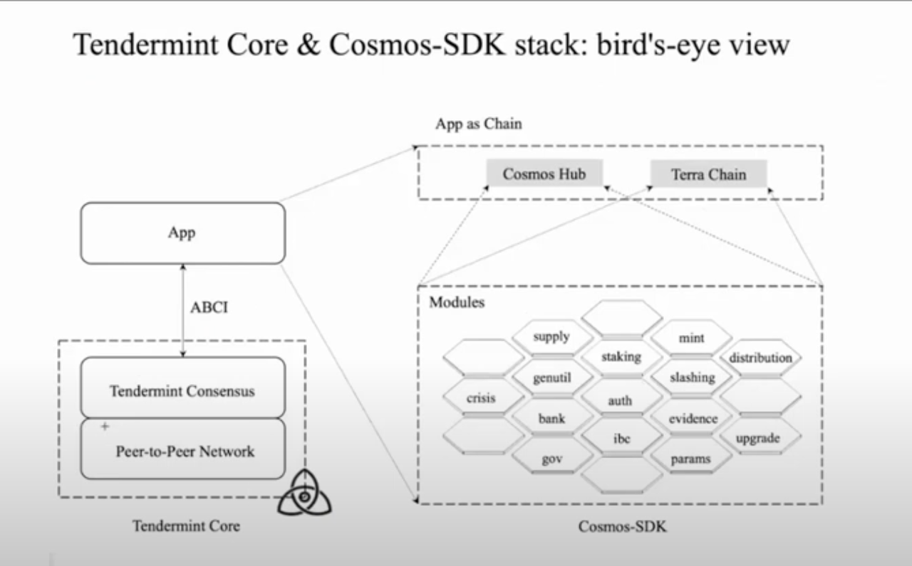

以下是三种技术的对比：
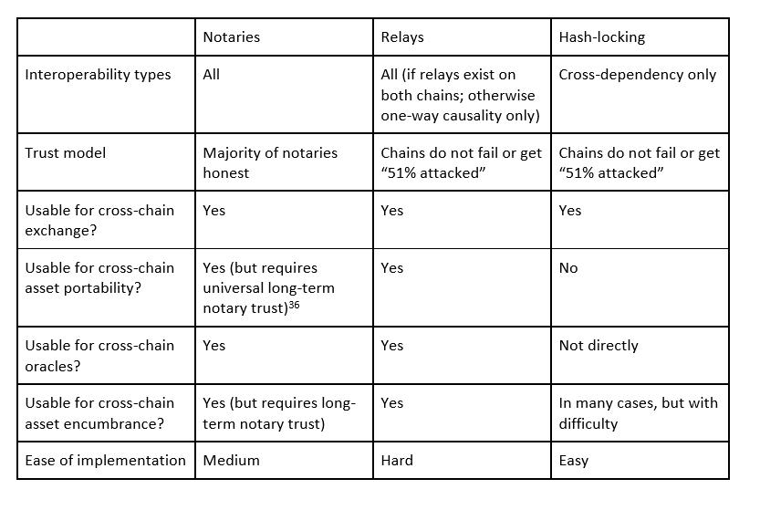

跨链项目介绍
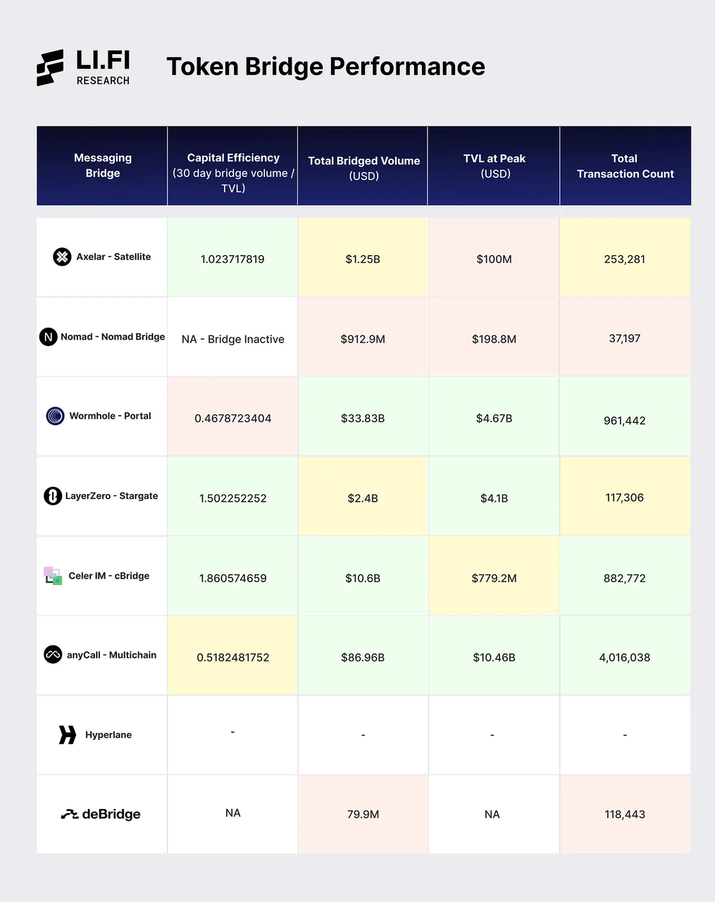
HTLC：
cBridge(V1)
https://github.com/celer-network/cBridge-contracts
The lifecycle of a cross-chain transfer is as simple as follow:

1. Sender sends transferOut tx on the source chain.
2. Bridge node sends transferIn tx on the destination chain, using the same hashlock set by the sender.
3. Sender confirms the transfer on the source chain.
4. Bridge node confirms the transfer on the destination chain.

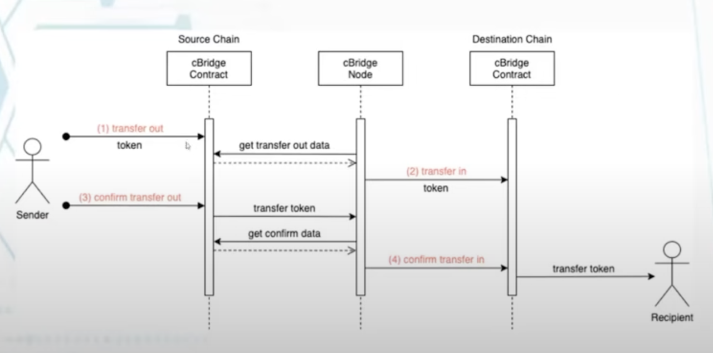
公证人机制：
Celer IM（V2）
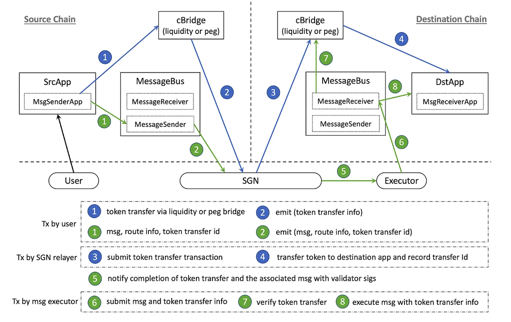
核心组件 Celer State Guardian Network (SGN)
https://cbridge-docs.celer.network/introduction/cbridge-security

参考文章：
https://medium.com/tokamak-network/cross-layer-transfer-celr-cbridge-78b9e0b1ca8b
https://medium.com/tokamak-network/comparison-hop-and-cbridge-for-cross-layer-transfer-a2950fbd1eea

中继方式：
LayerZero
白皮书：
https://www.semanticscholar.org/reader/9202ff8dcefad380cfefbfd4be84347beb9d827a
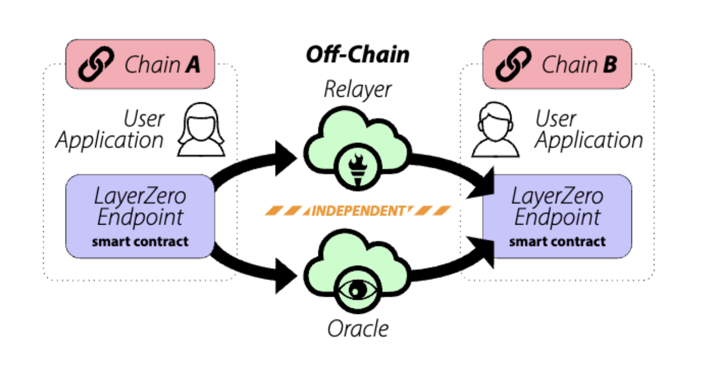
LayerZero 是一个全链互操作性协议，能够向支持的链上的任何智能合约发送消息。
三个组成部分：

1.  端点（endpoint）每条链上都需要具备 LayerZero 的端点。以进行消息的传输，即跨链相关的智能合约
2.  预言机（Oracle）预言机是第三方服务，从一个链中取区块头并将其发送至另一个链
3.  中继器：中继器是链外的服务，功能类似于预言机，为了获取特定交易的“证明”
    工作流程：

- 当用户应用从 A 链向 B 链发送消息时，该消息通过 A 链上的端点进行路由
- 然后端点通知预言机和中继器该消息及其目的链。
- 预言机将区块头转发给 B 链的端点
- 中继器提交交易证明。
- 该证明在目的链上被验证，消息被转发到目的地址。
  https://docs.layerzero.network/contracts/new-semantics
  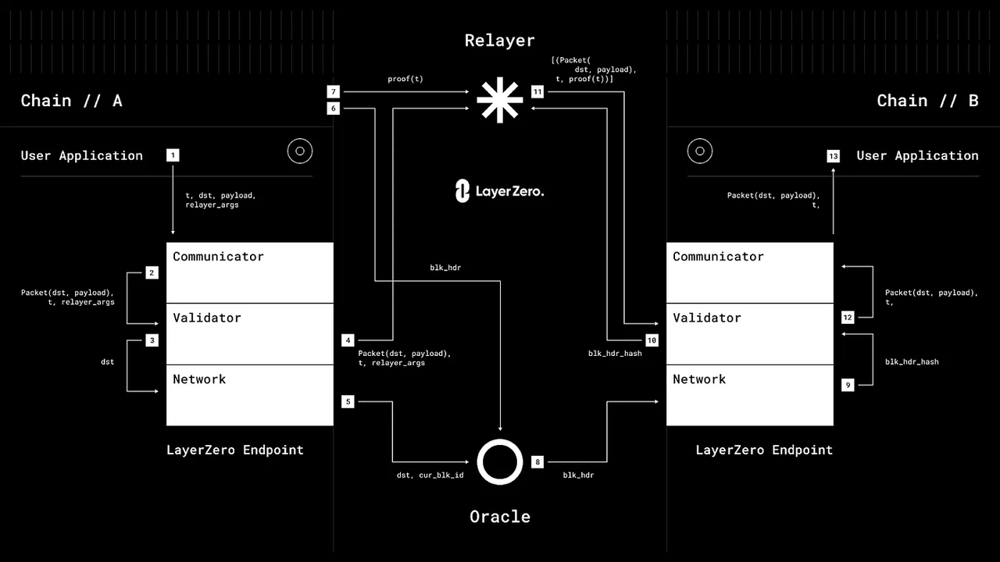
  Zkbridge
  whitepaper: https://dl.acm.org/doi/pdf/10.1145/3548606.3560652
  Layer0 需要信赖预言机，zkbridge 通过引入 zk 算法，将 blockheader 上传附带上 zkproof，这样目标链可以接收状态的变化。 减少了对 oracle 的依赖。

桥的核心功能就是 一个 block header relayer 网络。
C1 的 blockheader 以及对应的 proof，需要经由 relayer 传递到 C2 的 update contract。此合约验证 relayer 提交的 proof，维护 C1 最近的 blockheader。
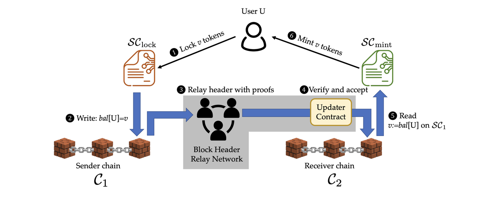
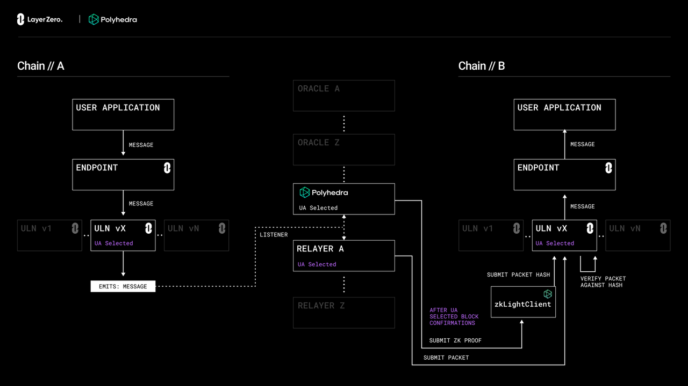

Layer2 的跨链：
Optimism L1-L2:
以 optimism 为例：
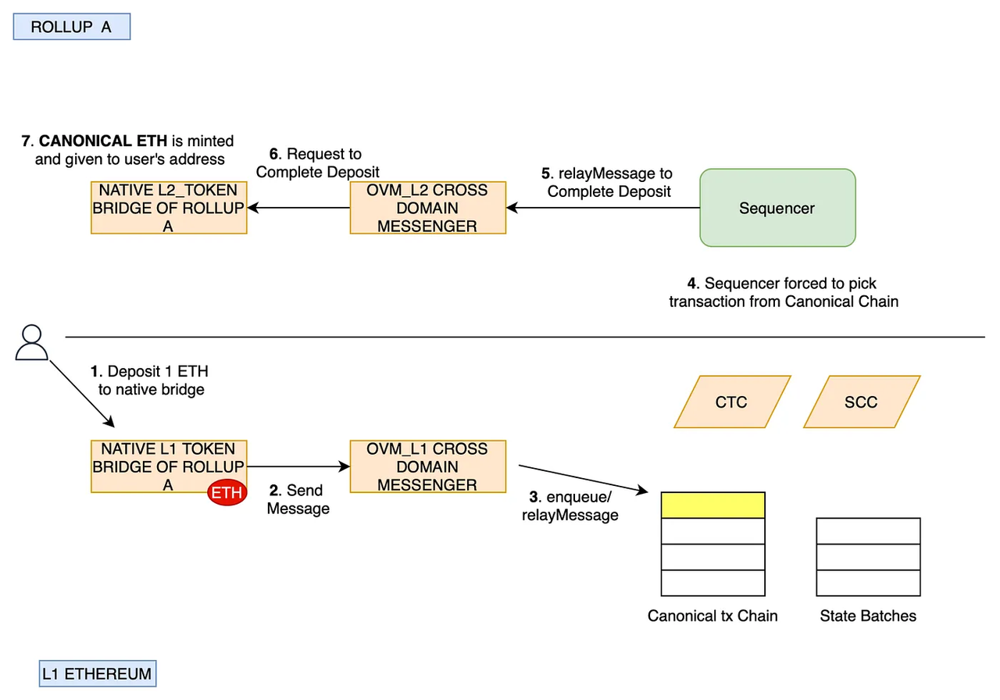
A bridge is responsible for holding the assets on a layer-1 blockchain while the same assets are released on another (and external) service. It defines who has custody of the funds and the conditions that must be satisfied before the assets can be unlocked.
There are two kinds of bridge
Standard bridge:
https://medium.com/onther-tech/fast-withdrawals-in-optimistic-rollups-part-1-6fbb93abf1c3
Liquidity provider（ fast withdrawal）
https://medium.com/tokamak-network/fast-withdrawals-in-optimistic-rollups-part-2-db27426d04af

1. token bridge
   In Optimism, we have L1_Standard Bridge and L2_Standard bridge that enables a user to deposit (L1-> L2) and withdraw(L2-> L1) ERC20 tokens.
2. Messenger Contracts，which enable the L1<->L2 communication.
   In optimism, we have OVM_L1CrossDomainMessenger and OVM_L2CrossDomainMessenger contracts come pre-deployed to the network.

Zksync L1->L2
https://docs.zksync.io/build/developer-reference/l1-l2-interoperability
MailboxFacet
https://github.com/matter-labs/era-contracts/blob/87cd8d7b0f8c02e9672c0603a821641a566b5dd8/l1-contracts/contracts/zksync/facets/Mailbox.sol#L343

HOP Protocol
Whitepaper: https://hop.exchange/whitepaper.pdf
Hop 是一个扩展性的的 rollup-to-rollup 去中心化跨链桥。使用者可以无须等待可以从 rollup 之间互转资产。

1.  创建了一个跨链桥 token,可以快速的从 rollup 之间互转，以及可以在 layer1 上取回底层资产。
2.  使用 AMM 实现 htoken 与对应代币间的互换，以便对流动性进行动态定价，并激励整个网络流动性的再平衡。
    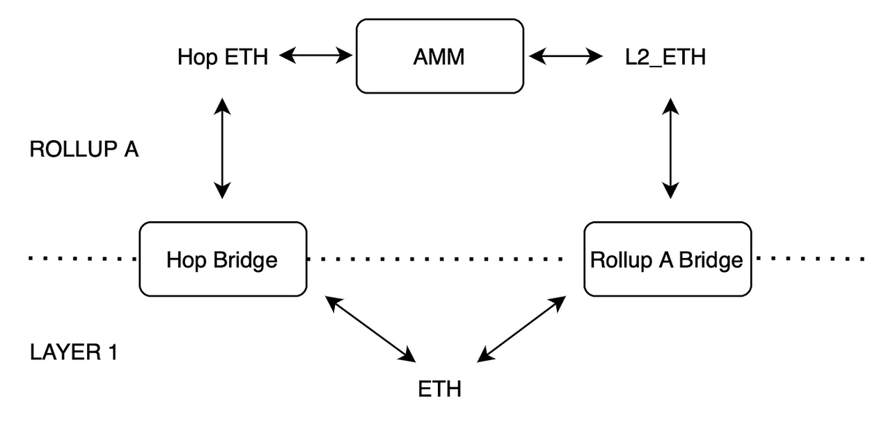
    组成部分：
    htoken： hop bridge 可以支持 htoken rollup 之间互转， 即销毁在源 rollup，重新铸造在目标 rollup。
    bonder： 流动性提供者。 需要抵押 110%的资金，他们可以 mint htoken，Bonder 可以在 24 小时挑战期后解锁资金。再次期间，谁都可以挑战 bonder，如果成功，则削减 bonder 的资产。
    AMM swap: htoken 适合跨链，但是换成 CANONICAL TOKEN 还需要一个 AMM swap.
    Hop transfer: 1. Destination Chain ID 2.Recipient 3. Amount
    TRANSFER ROOT:
    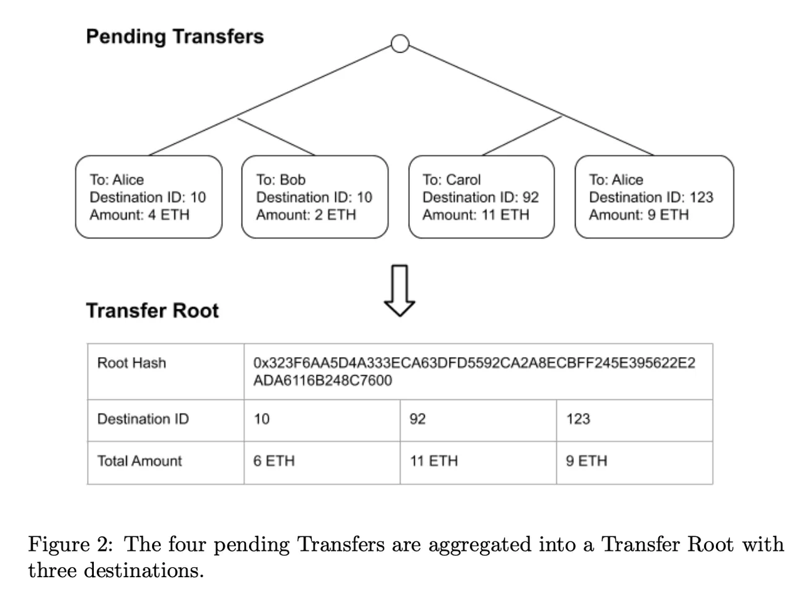
    可以几千笔交易一起打包再上传到 L1。
    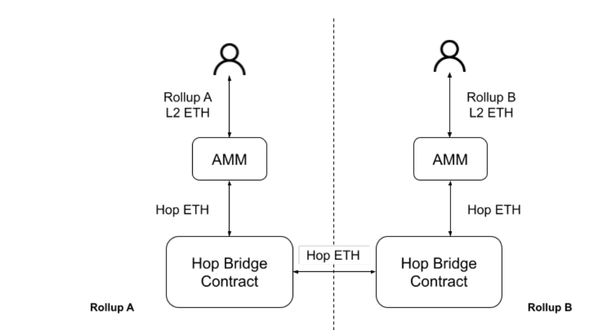

hop 的安全模型是很有竞争力的。 弱安全性的桥需要支付更高的利率去吸引流动性。 长期看来，无新人跨链桥可以提供比中心化桥更低的费率。
解析文章：https://medium.com/tokamak-network/cross-rollup-transfer-hop-protocol-2c10ea041e23

Across
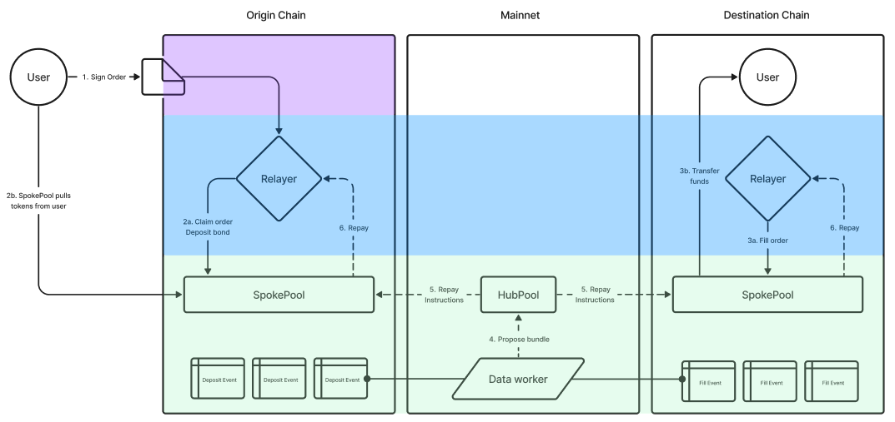
https://docs.across.to/concepts/intents-architecture-in-across

1. Users Request Quotes to Fill their Intent
2. Relayer Network Fills User
3. Settlement System Verifies Fills and Repays Relayer
   Settlement system aggregates valid fills events off-chain to create a repayment bundle, which is then optimistically verified by UMA's Optimistic Oracle.

- Over a 60 minute window, the Dataworker ingests deposit events, matches them to valid fill events (i.e. fills that meet the intent order requirements). All valid fills are aggregated into a relayer repayment "bundle" and optimistically proposed for verification.
- If no disputes occur during the challenge period, the Dataworker executes the bundle on the HubPool which then routes repayment instructions to the various SpokePools to repay relayers.
- Relayers are repaid after a short delay.

ERC 7683
https://www.erc7683.org/
The following standard allows for the implementation of a standard API for cross-chain trade execution systems. This standard provides a generic CrossChainOrder struct, as well as a standard ISettlementContract smart contract interface.

跨链聚合器 LI.FI
cheaply, quickly and securely 也是不可能三角。
https://li.fi/
https://jumper.exchange/

具体跨链代码在 Dapp-Learning 仓库：
https://github.com/Dapp-Learning-DAO/Dapp-Learning/tree/main/basic/80-crossChainTransfer

参考链接：
1 深度详解「跨链桥」基础要素、跨链技术与安全性： https://web3caff.com/zh/archives/27356
2 https://learnblockchain.cn/article/1553
3 https://cloud.tencent.com/developer/article/1856014
SPV： https://eprint.iacr.org/2021/1657.pdf
Zktree: https://eprint.iacr.org/2023/208
Recursive: https://ethresear.ch/t/reducing-the-verification-cost-of-a-snark-through-hierarchical-aggregation/5128/9
Navigating Arbitrary Messaging Bridges: A Comparison Framework:
https://blog.li.fi/navigating-arbitrary-messaging-bridges-a-comparison-framework-8720f302e2aa
Hop:
https://blog.li.fi/hop-protocol-a-deep-dive-5075eddc4dd
https://foresightnews.pro/article/detail/3454
layer0: https://medium.com/layerzero-official/layerzero-v2-deep-dive-869f93e09850
跨链资产标准：https://ethereum-magicians.org/t/outlining-a-standard-interface-for-cross-domain-erc20-transfers/6151/2
https://github.com/hop-exchange/contracts/blob/master/assets/Hop_Transfer_Diagrams.jpg
https://blog.dodoex.io/%E8%B7%A8%E9%93%BE%E6%BC%AB%E8%B0%88-%E6%B7%B1%E5%BA%A6%E8%A7%A3%E6%9E%9016%E4%B8%AA%E8%B7%A8%E9%93%BE%E6%96%B9%E6%A1%88%E6%9D%83%E8%A1%A1-a4e98d248eb2
op and zksync ：
Op standardBridge:
https://github.com/ethereum-optimism/optimism/blob/65ec61dde94ffa93342728d324fecf474d228e1f/packages/contracts-bedrock/contracts/universal/StandardBridge.sol
Standard bridge:
https://medium.com/onther-tech/fast-withdrawals-in-optimistic-rollups-part-1-6fbb93abf1c3
Liquidity provider（ fast withdrawal）
https://medium.com/tokamak-network/fast-withdrawals-in-optimistic-rollups-part-2-db27426d04af
